COVID-19 Analysis for Brazil
*******************************************************************************
This section contains analysis done for Brazil.

Brazil: country-wide analysis
===============================================================================

.. _DeathCountModelling:

Bayesian death count modelling
-------------------------------------------------------------------------------
It is known that there is a heavy under-reporting of cases in Brazil due to
lack of testing capacity (this was acknoledged by the government), therefore
using confirmed cases poses difficult challenges. I decided to focus this
analysis on the deaths, as they seem to be less impacted by the lack of the
testing capacity.

To model the death counts I used a `Negative Binomial` likelihood, the same
distribution used in the work `Estimating the number of infections and the impact
of nonpharmaceutical interventions on COVID-19 in 11 European countries <https://www.imperial.ac.uk/mrc-global-infectious-disease-analysis/covid-19/report-13-europe-npi-impact/>`_ by Imperial College London.

The negative binomal distribution is interesting because it is a discrete distribution
and can be used to model over-dispersion as Poisson assumes :math:`\mathrm{E}[x] = \mathrm{Var}[x]`,
therefore we can have more flexibility to model variance separately.

The priors of the model are described below:

.. math::

	\begin{array}{rcl}
    \text{alpha_mu} &\sim & \text{Normal}(\mathit{mu}=0.0,~\mathit{sigma}=10.0)\\\text{alpha} &\sim & \text{Normal}(\mathit{mu}=\text{alpha_mu},~\mathit{sigma}=10.0)\\\text{beta_mu} &\sim & \text{Normal}(\mathit{mu}=0.0,~\mathit{sigma}=10.0)\\\text{beta} &\sim & \text{Normal}(\mathit{mu}=\text{beta_mu},~\mathit{sigma}=10.0)\\\text{sigma} &\sim & \text{HalfCauchy}(\mathit{beta}=50.0)\\\text{y} &\sim & \text{NegativeBinomial}(\mathit{mu}=f(f(\text{alpha}),~f(f(f(\text{beta}),~\text{data_x}))),~\mathit{alpha}=\text{sigma})
    \end{array}

The model is an exponential model as it is a very good approximation due to the natural phenomena that
arises from the nature of viruses transmission dynamics. The model is:

.. math::

	f(t) = \alpha e^{\beta t}

Where :math:`\beta` is the growth coefficient and :math:`t` is the time index. The model in plate notation
is also shown below:

.. raw:: html
	:file: death_count_br_plate.html

Sampling the posterior of these models without doing reparametrization can be complicated due to the shape of it as
shown below:

.. image:: _static/br/posterior.png
  :width: 700

However, due to the lack of time, I'm still sampling this posterior. I use the MCMC Hamiltonian
Monte Carlo (`A Conceptual Introduction to Hamiltonian Monte Carlo <https://arxiv.org/pdf/1701.02434>`_) with
at least 4 chains (68k samples, including the tuning steps).

.. warning:: This model doesn't model the effect of interventions, at some point in time it will
             cease to be calibrated due to the effect of non-pharmaceutical interventions made
             by the government.

.. note:: This model uses data from the `official government website <https://covid.saude.gov.br/>`_.

.. _ICUModelling:

Bayesian ICU (UTI) occupancy forecasts
-------------------------------------------------------------------------------
This model is a very simple bayesian exponential regression for a discrete negative
binomial distribution with the following priors:

.. math::

	\begin{array}{rcl}
	\text{alpha} &\sim & \text{Normal}(\mathit{mu}=0.0,~\mathit{sigma}=10.0)\\\text{beta} &\sim & \text{Normal}(\mathit{mu}=0.0,~\mathit{sigma}=10.0)\\\text{sigma} &\sim & \text{HalfCauchy}(\mathit{beta}=10.0)\\\text{y} &\sim & \text{NegativeBinomial}(\mathit{mu}=f(f(f(\text{alpha}),~f(f(\text{beta}),~\text{data_x}))),~\mathit{alpha}=\text{sigma})
	\end{array}

And the following model diagram:

.. raw:: html
	:file: icu_poa_model_plate.html

.. note:: This model uses data from the `official SMS-POA website <http://www.portoalegre.rs.gov.br/>`_.

**04/April** -- Severe Acute Respiratory Syndrome (SARS) cases in Brazil (Fiocruz)
------------------------------------------------------------------------------------
These are plots using data from Fiocruz (see below for the link of the website with this data).

.. rubric:: Cases per year and per epidemiological week

In this plot, we have Fiocruz data since 2017 until 2020. We can see a huge increase
of the hospitalizations after the beginning of March and after the first detected
case of COVID-19 in Brazil.

.. image:: _static/br/infogripe.png
  :width: 750

.. note:: Note that due to the COVID-19 outbreak, more people went to the hospitals to search
          for assistance, so there is a inflation there as well. Also note that the fact that
          the interventions also reduces the basic reproduction number of other viruses, it
          will also have an effect (very difficult to measure) on this plot as well, by deflating
          the traditional number of cases. 

.. rubric:: Absolute difference of cases per states in Brazil

This plot is a little more complex to understand:

In the **left panel** we have the absolute difference
of cases from the epidemiological week 13th between 2019 and 2020. As we can see, the state
of São Paulo (SP) is the one with the largest difference when compared with other states, clearly
showing the evidence of COVID-19 patients.

On the **right panel**, we have have the number of COVID-19 confirmed cases per state in Brazil
(until April 4th). As we can see, there is a clear correlation of differences in the cases on
the left panel with the COVID-19 cases on the right panel.

Interesting cases here are RS and DF (among others). When we compare the differences in RJ vs RS, we
can see that they are very similar, however, when we look at the number of cases, RJ has much more
cases than RS, an evidence that can tell that the under-reporting in the RS is potentially much
higher than in the RJ.

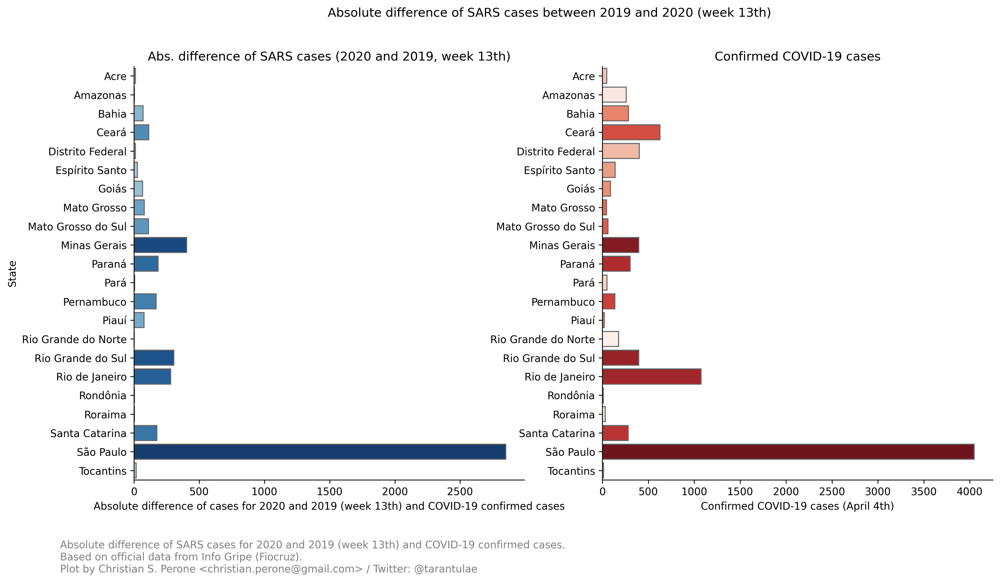

.. note:: This model uses official data from Fiocruz `website <http://info.gripe.fiocruz.br>`_.

**07/April** -- Death count analysis and forecast
-------------------------------------------------------------------------------
.. rubric:: Forecast from the model

.. image:: _static/br/br_deaths_07apr.png
  :width: 750

.. rubric:: Growth coefficient estimation

.. image:: _static/br/br_deaths_07apr_coeff.png
  :width: 750

.. rubric:: Sampling diagnostics

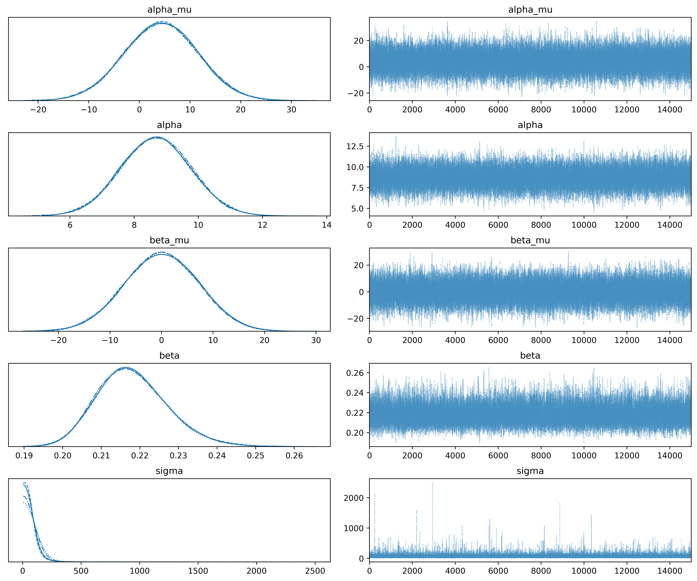

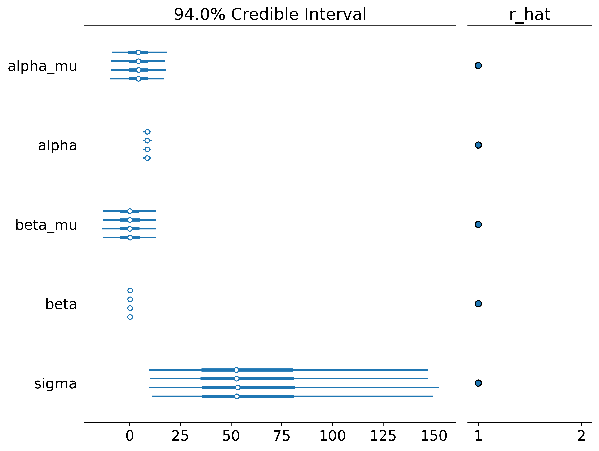

.. seealso:: This model uses the modelling approach described at :ref:`DeathCountModelling`.

**08/April** -- Death count analysis and forecast
-------------------------------------------------------------------------------
.. rubric:: Forecast from the model

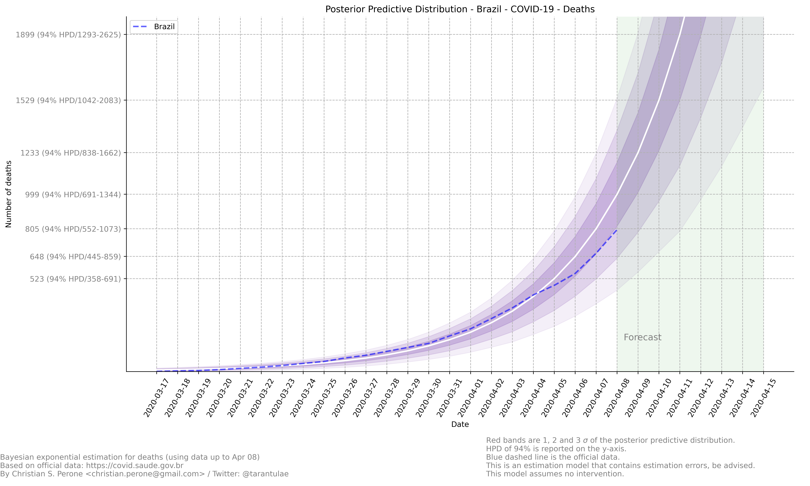

.. rubric:: Growth coefficient estimation

.. image:: _static/br/br_deaths_08apr_coeff.png
  :width: 750

.. seealso:: This model uses the modelling approach described at :ref:`DeathCountModelling`.

**09/April** -- Death count analysis and forecast
-------------------------------------------------------------------------------
.. rubric:: Forecast from the model

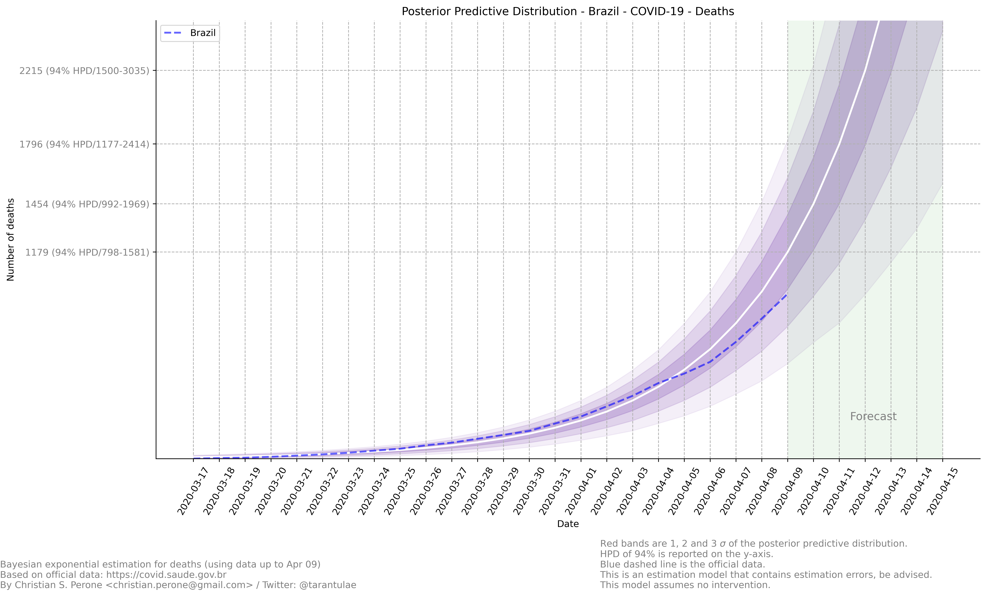

.. rubric:: Growth coefficient estimation

.. image:: _static/br/br_deaths_09apr_coeff.png
  :width: 750

.. seealso:: This model uses the modelling approach described at :ref:`DeathCountModelling`.

**09/April** -- Death count reported by government vs notary's offices
-------------------------------------------------------------------------------
These are plots showing the difference in the COVID-19 death counts for the deaths
that were registered on brazilian notary offices and compared with the
deaths reported by the government. Data until April 8th.

.. rubric:: Plots for different states of Brazil

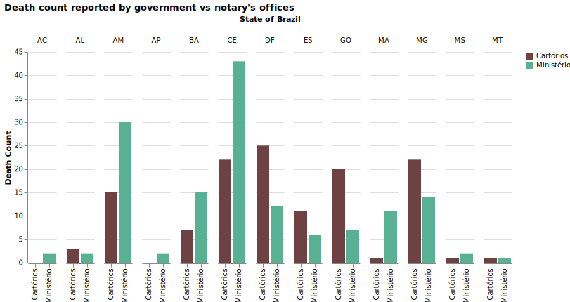

.. image:: _static/br/ministerio_vs_cartorio_p2.svg
  :width: 800

.. rubric:: For São Paulo (SP) and Rio de Janeiro (RJ)

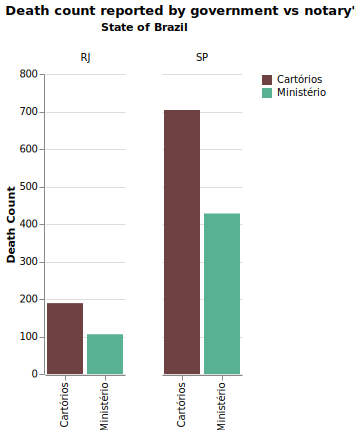

.. note:: This plot used data from official government website and from
          the notary offices open data portal. Note that the notary offices
          includes also deaths that were not yet COVID-19 confirmed together
          with COVID-19 confirmed.

**10/April** -- Death count analysis and forecast
-------------------------------------------------------------------------------
.. rubric:: Forecast from the model

.. image:: _static/br/br_deaths_10apr.png
  :width: 750

.. rubric:: Growth coefficient estimation

.. image:: _static/br/br_deaths_10apr_coeff.png
  :width: 750

.. seealso:: This model uses the modelling approach described at :ref:`DeathCountModelling`.

**11/April** -- Death count analysis and forecast
-------------------------------------------------------------------------------
.. rubric:: Forecast from the model

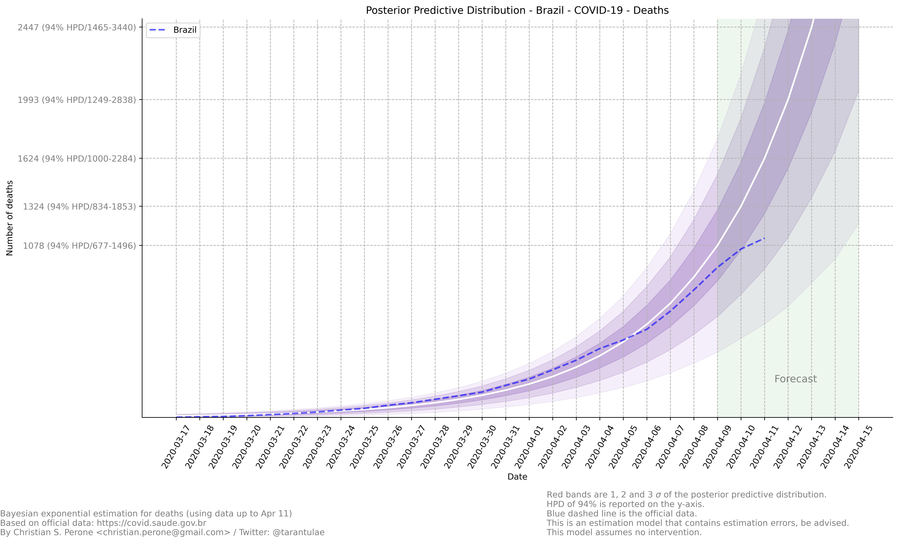

.. rubric:: Growth coefficient estimation

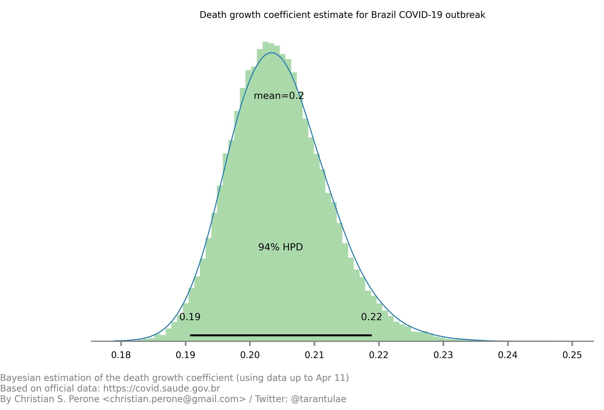

.. seealso:: This model uses the modelling approach described at :ref:`DeathCountModelling`.

**12/April** -- Death count analysis and forecast
-------------------------------------------------------------------------------
.. rubric:: Forecast from the model

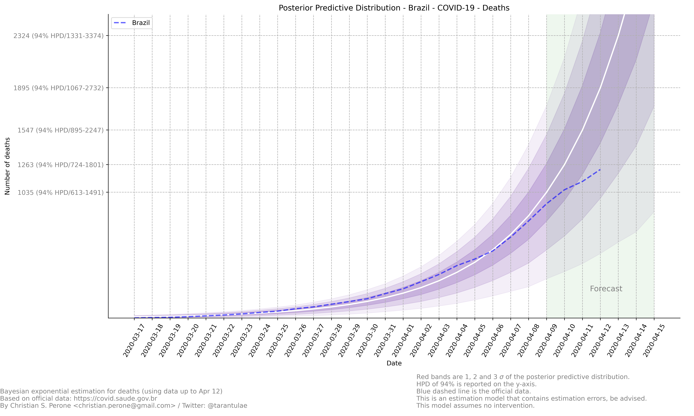

.. rubric:: Growth coefficient estimation

.. image:: _static/br/br_deaths_12apr_coeff.png
  :width: 750

.. seealso:: This model uses the modelling approach described at :ref:`DeathCountModelling`.

**13/April** -- Death count analysis and forecast
-------------------------------------------------------------------------------
.. rubric:: Forecast from the model

.. image:: _static/br/br_deaths_13apr.png
  :width: 750

.. rubric:: Growth coefficient estimation

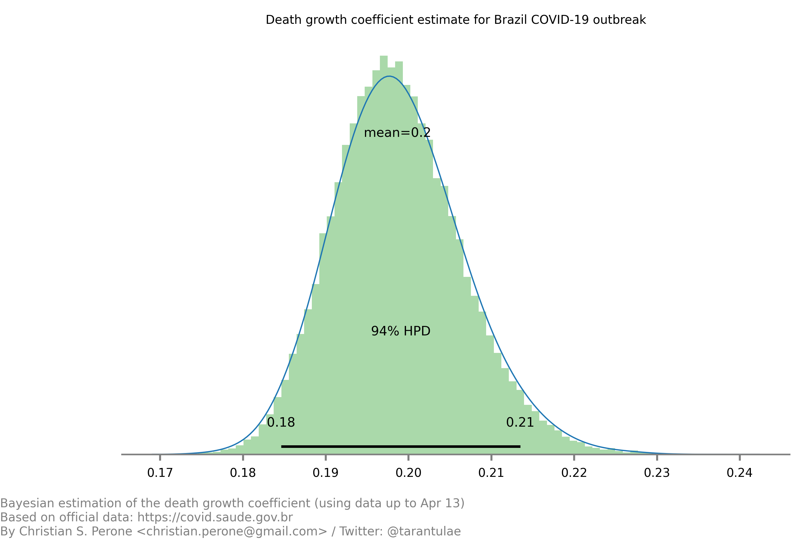

.. seealso:: This model uses the modelling approach described at :ref:`DeathCountModelling`.

State: Rio Grande do Sul (RS)
===============================================================================
These are focused analysis on the state of Rio Grande do Sul/Brazil.

**07/April** -- Mapping transmission through time
-------------------------------------------------------------------------------
This is a short animation showing the cities with reported infections in 
Rio Grande do Sul (RS)/Brazil for the date range of **March 10th** until
**April 6th**.

.. raw:: html

	<video controls width="740">
    <source src="_static/br/rsmap.mp4"
            type="video/mp4">
    	Sorry, your browser doesn't support embedded videos.
	</video>

.. note:: This animation used data from `Brasil.io <http://www.brasil.io/>`_, which is collected from
          the `TI Saude RS <http://ti.saude.rs.gov.br/covid19/>`_.

**09/April** -- Mapping transmission through time
-------------------------------------------------------------------------------
This is a short animation showing the cities with reported infections in 
Rio Grande do Sul (RS)/Brazil for the date range of **March 10th** until
**April 9th**.

.. raw:: html

	<video controls width="740">
    <source src="_static/br/rsmap_apr09.mp4"
            type="video/mp4">
    	Sorry, your browser doesn't support embedded videos.
	</video>

.. note:: This animation used data from `Brasil.io <http://www.brasil.io/>`_, which is collected from
          the `TI Saude RS <http://ti.saude.rs.gov.br/covid19/>`_.

**09/April** -- ICU (UTI) Occupancy Forecast for Porto Alegre/RS
-------------------------------------------------------------------------------
.. rubric:: ICU forecast

.. image:: _static/br/icu_apr9_portoalegre.png
  :width: 750

.. seealso:: This model uses the modelling approach described at :ref:`ICUModelling`.

**10/April** -- ICU (UTI) Occupancy Forecast for Porto Alegre/RS
-------------------------------------------------------------------------------
.. rubric:: ICU forecast

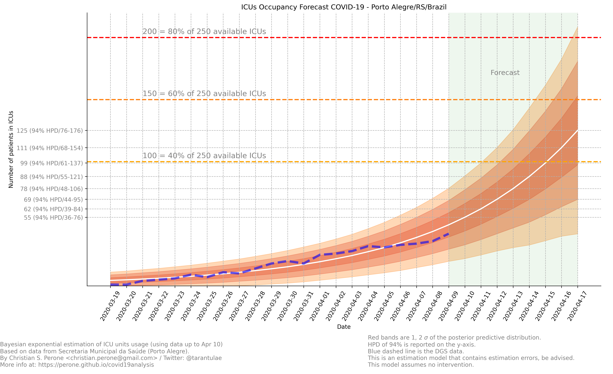

.. seealso:: This model uses the modelling approach described at :ref:`ICUModelling`.

**10/April** -- ICU (UTI) Occupancy Animation for Porto Alegre/RS
-------------------------------------------------------------------------------
.. rubric:: ICU forecast

.. raw:: html

  <video controls width="740">
    <source src="_static/br/icu_poa_anim.mp4"
            type="video/mp4">
      Sorry, your browser doesn't support embedded videos.
  </video>

.. seealso:: This model uses the modelling approach described at :ref:`ICUModelling`.

**11/April** -- Age distribution of infected cases by time for Porto Alegre/RS
-------------------------------------------------------------------------------
This plot shows the age (binned in steps of 5) distribution of infected
cases by the time of notification (y-axis). Data until Apr 10th 2020.

.. image:: _static/br/poa_age_time_apr11.svg
  :width: 800

.. note:: This plot uses official data from Porto Alegre/RS reports until
          until Apr 10th 2020.

**11/April** -- Gender distribution of infected cases by time for Porto Alegre/RS
---------------------------------------------------------------------------------
This plot shows the gender distribution of infected
cases by the time of notification (x-axis). Data until Apr 10th 2020.

.. image:: _static/br/poa_gender_time_apr11.svg
  :width: 800

.. note:: This plot uses official data from Porto Alegre/RS reports until
          until Apr 10th 2020.

**11/April** -- Estimated instantaneous reproduction number for Rio Grande do Sul (RS)
--------------------------------------------------------------------------------------
This plot shows the estimation of the instantaneous reproduction number for Rio
Grande do Sul (RS) / Brazil. This plot uses the method described in the work 
`A New Framework and Software to Estimate Time-Varying Reproduction Numbers During Epidemics <https://www.ncbi.nlm.nih.gov/pmc/articles/PMC3816335/>`_. We used the serial interval parameters similar to the ones used
by `CMMID <https://cmmid.github.io/topics/covid19/>`_ with a :math:`\mu = 4.7 (3.7 - 6.0)`
and :math:`\sigma = 2.9 (1.9 - 4.9)` with a log-normal distribution.

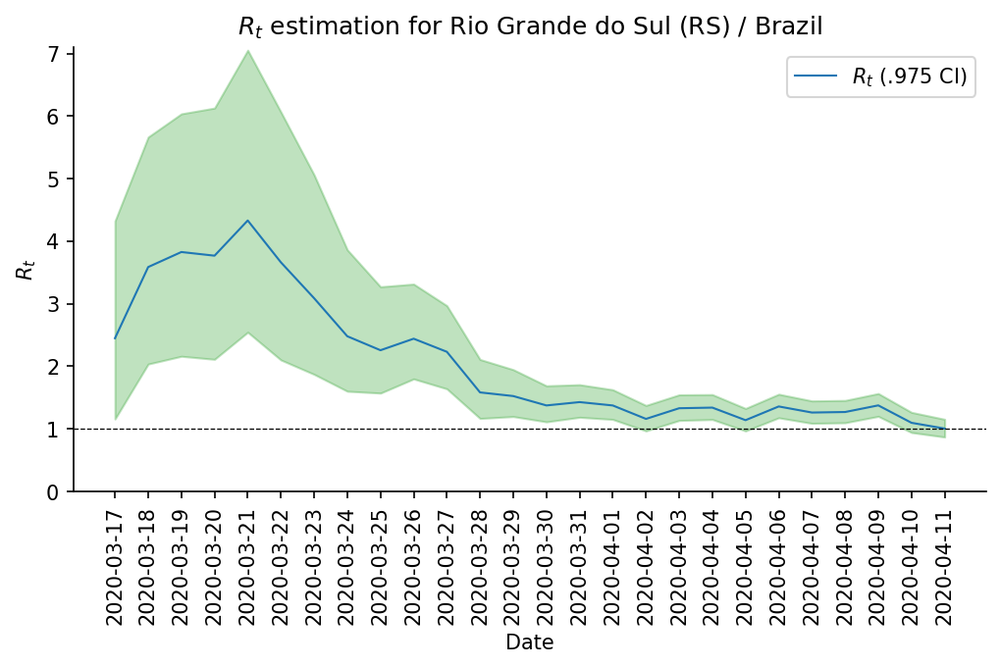

.. note:: This plot uses official data from government, reports until
          Apr 11th 2020. This method is sensitive to changes in COVID-19
          testing procedures and the level of effort used to detect cases.
          Therefore, changes in the testing efforts will introduce bias
          if the testing practices are not kept consistent. So please
          keep in mind these limitations, that are often not stated in
          many analysis around there.

**12/April** -- What Rio Grande do Sul (RS) and Portugal have in common ?
--------------------------------------------------------------------------------------
Portugal and Rio Grande do Sul (RS), a state of Brazil, share not only
the same language but also other similarities in the fight for COVID-19.

First, their populations are very similar, with 10.28 million in Portugal
and 11.29 million in Rio Grande do Sul (RS). During the COVID-19 outbreak,
they adopted similar measures and coincidentally some of them were
taken at the same time, such as school closures and state of emergency.

This is an interesting comparison because Portugal had the first confirmed
case on March 2nd while Rio Grande do Sul (RS) had the first confirmed
case on March 10th.

Below you can see a plot with the estimated R number both for Portugal
and for Rio Grande do Sul. Given all the limitations of this comparison
(see below), it is nevertheless interesting to see that Rio Grande do Sul (RS)
seems to have achieved a lower R value before Portugal probably due to the
short time to take measures after confirming the first case.

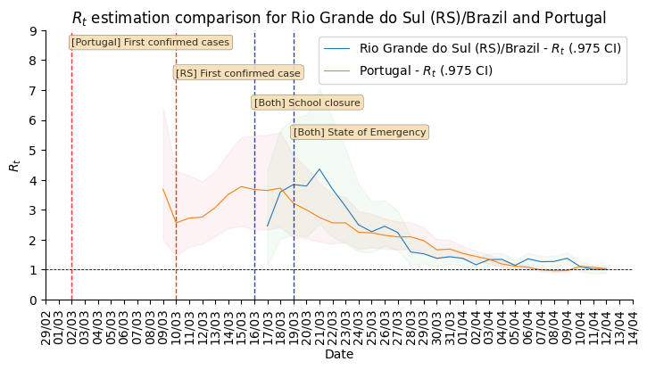

.. note:: Limitations:
  
  - Population density is different;
  - Imported cases probably much higher in Portugal;
  - Different testing capacities (RS is doing ~400/day now);
  - Biased R estimation due to changes in testing procedures;
  - Interventions after state of emergency were a little different;

**12/April** -- Mapping transmission through time
-------------------------------------------------------------------------------
This is a short animation showing the cities with reported infections in 
Rio Grande do Sul (RS)/Brazil for the date range of **March 10th** until
**April 12th**.

.. raw:: html

  <video controls width="740">
    <source src="_static/br/rsmap_apr12.mp4"
            type="video/mp4">
      Sorry, your browser doesn't support embedded videos.
  </video>

.. note:: This animation used data from `Brasil.io <http://www.brasil.io/>`_, which is collected from
          the `TI Saude RS <http://ti.saude.rs.gov.br/covid19/>`_.

**12/April** -- ICU (UTI) Occupancy Forecast for Porto Alegre/RS
-------------------------------------------------------------------------------
.. rubric:: ICU forecast

.. image:: _static/br/icu_apr12_portoalegre.png
  :width: 750

.. seealso:: This model uses the modelling approach described at :ref:`ICUModelling`.

**15/April** -- Regarding results from UFPel study in Brazil
-------------------------------------------------------------------------------
I just became aware of the results from UFPel in Brazil, where they did a
randomized study with N=4189 valid tests in 8 cities of Rio Grande do Sul (RS).
The results found anti-bodies in K=2 subjects, among N=4189 tested subjects.

What I found impressive, is that UFPel did a terrible job in presenting the
results, by not incorporating the uncertainty into the results that they
showed to the public. This was a terrible mistake they did, not to mention
the rounding of some numbers (to make it look bigger ?).

Let's go with the analysis: we have N=4189 and K=2, this means a proportion
of 0.047% and not 0.05% that they reported. Secondly, they estimated a total
of 5650 infections for the state by taking into consideration a population
of P=11,300.000 (11.3M) people. So, P*(K/N) gives us 5395 with the proportion
of 0.047% and not the 5650 that they got by rounding numbers.

Another issue that bothers me a lot is that they reported the results without
proper confidence interval, which is of course huge due to the small
sample size. But wait, there is more, the test has a sensitivity of 77% and a
specificity of 98% (tested by themselves), so where is this uncertainty ?

I wonder what epidemiologists of UFPel are doing by being so naive in these
calculations that are crucial to incorporate uncertainty and report it
correctly to the public. The state is spending a lot of tests into this
study, and those tests are tests that won't be used for contact tracing
and control, so it is very frustrating to see these analysis.

**15/April** -- Mapping transmission through time
-------------------------------------------------------------------------------
This is a short animation showing the cities with reported infections in 
Rio Grande do Sul (RS)/Brazil for the date range of **March 10th** until
**April 15th**.

.. raw:: html

  <video controls width="740">
    <source src="_static/br/rsmap_apr15.mp4"
            type="video/mp4">
      Sorry, your browser doesn't support embedded videos.
  </video>

.. note:: This animation used data from `Brasil.io <http://www.brasil.io/>`_, which is collected from
          the `TI Saude RS <http://ti.saude.rs.gov.br/covid19/>`_.

**16/April** -- Elderly population risk estimation
-------------------------------------------------------------------------------

.. image:: _static/br/elderly_rs_risk.png
  :width: 800

