**27/May** -- COVID-19 Time varying reproduction numbers estimation for Brazil
*****************************************************************************************************
These plots show the estimation of the instantaneous reproduction number for all
the states in Brazil. These reports uses the method described in the work 
`A New Framework and Software to Estimate Time-Varying Reproduction Numbers During Epidemics <https://www.ncbi.nlm.nih.gov/pmc/articles/PMC3816335/>`_. We used the serial interval parameters similar to the ones used
by `CMMID <https://cmmid.github.io/topics/covid19/>`_ with a :math:`\mu = 4.7 (3.7 - 6.0)`
and :math:`\sigma = 2.9 (1.9 - 4.9)`.

.. note:: This plot uses official data from government, reports until
          27/May. This method is sensitive to changes in COVID-19
          testing procedures and the level of effort used to detect cases.
          Therefore, changes in the testing efforts will introduce bias
          if the testing practices are not kept consistent. So please
          keep in mind these limitations, that are often not stated in
          many analysis around there. Imported cases weren't also
          considered in this analysis, neither the delay of the symptoms
          onset and reporting.

.. warning:: Remember that this is the instantaneous reproduction number, therefore when
             it is below 1.0 for one or two days, it doesn't mean everything is ok.
             This method is less sensitive to under-reporting but as long as the bias is
             constant. So please, read the plots with the limitations and mind.
             As an example, Portugal had an R(t) below 1.0 for almost 3 weeks
             before relaxing interventions, so keep in mind that it is not
             about being below 1.0 for a single day but for weeks.

Summary for the last instantaneous reproduction number estimate
===============================================================================
.. rubric:: Map for the accumulated cases

.. raw:: html

    <iframe src="_static/restim_cases_map.html" height="591px" width="100%" frameBorder="0"></iframe>

.. rubric:: Map for the last instantaneous reproduction number estimate

.. raw:: html

    <iframe src="_static/restim_map.html" height="591px" width="100%" frameBorder="0"></iframe>

.. rubric:: Map of states with mean reproduction number R(t) > 1.0

.. raw:: html

    <iframe src="_static/restim_badr_map.html" height="591px" width="100%" frameBorder="0"></iframe>

.. rubric:: Map for the accumulated deaths by COVID-19

.. raw:: html

    <iframe src="_static/restim_deaths_map.html" height="591px" width="100%" frameBorder="0"></iframe>

.. rubric:: Summary for the last instantaneous reproduction number estimate

Last update: **27/May**

.. image:: _static/br/r0_estim/estim_all.svg
    :width: 800

.. rubric:: Summary table for the last instantaneous reproduction number estimate

.. raw:: html
    
    

    <table class="greyGridTable">
    <thead>
    <tr>
    <th>State</th> 
    <th>Mean Estimated R (CI 0.975)</th>
    </tr>
    </thead>
    <tbody>
    
    <tr>
        <td>MT</td>
        <td>1.61 (1.44 - 1.79)</td>
    </tr>
    
    <tr>
        <td>MS</td>
        <td>1.50 (1.30 - 1.72)</td>
    </tr>
    
    <tr>
        <td>MA</td>
        <td>1.49 (1.33 - 1.68)</td>
    </tr>
    
    <tr>
        <td>AP</td>
        <td>1.48 (1.34 - 1.65)</td>
    </tr>
    
    <tr>
        <td>AL</td>
        <td>1.47 (1.33 - 1.62)</td>
    </tr>
    
    <tr>
        <td>MG</td>
        <td>1.45 (1.31 - 1.60)</td>
    </tr>
    
    <tr>
        <td>PB</td>
        <td>1.43 (1.34 - 1.51)</td>
    </tr>
    
    <tr>
        <td>AC</td>
        <td>1.42 (1.25 - 1.65)</td>
    </tr>
    
    <tr>
        <td>PR</td>
        <td>1.37 (1.23 - 1.52)</td>
    </tr>
    
    <tr>
        <td>PA</td>
        <td>1.36 (1.25 - 1.46)</td>
    </tr>
    
    <tr>
        <td>RO</td>
        <td>1.29 (1.18 - 1.41)</td>
    </tr>
    
    <tr>
        <td>DF</td>
        <td>1.23 (1.17 - 1.31)</td>
    </tr>
    
    <tr>
        <td>RN</td>
        <td>1.22 (1.12 - 1.30)</td>
    </tr>
    
    <tr>
        <td>GO</td>
        <td>1.19 (1.11 - 1.28)</td>
    </tr>
    
    <tr>
        <td>PI</td>
        <td>1.19 (1.11 - 1.27)</td>
    </tr>
    
    <tr>
        <td>TO</td>
        <td>1.16 (1.06 - 1.27)</td>
    </tr>
    
    <tr>
        <td>ES</td>
        <td>1.12 (1.06 - 1.18)</td>
    </tr>
    
    <tr>
        <td>AM</td>
        <td>1.12 (1.07 - 1.16)</td>
    </tr>
    
    <tr>
        <td>SC</td>
        <td>1.10 (1.04 - 1.16)</td>
    </tr>
    
    <tr>
        <td>SP</td>
        <td>1.03 (1.00 - 1.06)</td>
    </tr>
    
    <tr>
        <td>RJ</td>
        <td>0.98 (0.92 - 1.04)</td>
    </tr>
    
    <tr>
        <td>RR</td>
        <td>0.96 (0.88 - 1.05)</td>
    </tr>
    
    <tr>
        <td>PE</td>
        <td>0.92 (0.88 - 0.97)</td>
    </tr>
    
    <tr>
        <td>RS</td>
        <td>0.88 (0.80 - 0.98)</td>
    </tr>
    
    <tr>
        <td>SE</td>
        <td>0.85 (0.80 - 0.91)</td>
    </tr>
    
    <tr>
        <td>BA</td>
        <td>0.84 (0.78 - 0.89)</td>
    </tr>
    
    <tr>
        <td>CE</td>
        <td>0.65 (0.61 - 0.69)</td>
    </tr>
    
    </tbody>
    </table>

.. rubric:: Summary for the Facebook COVID-like illness survey (last date)

.. image:: _static/br/facebook_survey/estim_all.svg
    :width: 800

.. note:: This is the summary for the Facebook COVID-like illness survey using
          the last survey date available for each state. Note that not all states
          have the same last date available, for more information please look
          at the plots for each state to see dynamics of these results and
          also the last available date.

.. rubric:: Summary table for the Facebook COVID-like illness (CLI) survey (last date)

.. raw:: html
    
    <table class="greyGridTable">
    <thead>
    <tr>
    <th>State</th> 
    <th>Weighted Percent of CLI responses (95% CI)</th>
    <th>Sample Size</th>
    <th>Survey Date</th>

    </tr>
    </thead>
    <tbody>
    
    <tr>
        <td>Amapá</td>
        <td>10.96 (5.37 - 16.54)</td>
        <td>208</td>
        <td>26-05-2020
    </tr>
    
    <tr>
        <td>Acre</td>
        <td>8.00 (2.54 - 13.46)</td>
        <td>135</td>
        <td>26-05-2020
    </tr>
    
    <tr>
        <td>Amazonas</td>
        <td>6.25 (3.61 - 8.89)</td>
        <td>694</td>
        <td>26-05-2020
    </tr>
    
    <tr>
        <td>Maranhão</td>
        <td>5.65 (3.30 - 8.00)</td>
        <td>582</td>
        <td>26-05-2020
    </tr>
    
    <tr>
        <td>Roraima</td>
        <td>5.05 (-14.36 - 24.46)</td>
        <td>125</td>
        <td>26-05-2020
    </tr>
    
    <tr>
        <td>Pará</td>
        <td>4.75 (2.39 - 7.12)</td>
        <td>454</td>
        <td>26-05-2020
    </tr>
    
    <tr>
        <td>Tocantins</td>
        <td>4.56 (0.70 - 8.42)</td>
        <td>199</td>
        <td>26-05-2020
    </tr>
    
    <tr>
        <td>Rondônia</td>
        <td>4.05 (1.64 - 6.46)</td>
        <td>376</td>
        <td>26-05-2020
    </tr>
    
    <tr>
        <td>Ceará</td>
        <td>3.73 (1.75 - 5.71)</td>
        <td>523</td>
        <td>26-05-2020
    </tr>
    
    <tr>
        <td>Alagoas</td>
        <td>3.44 (1.14 - 5.75)</td>
        <td>386</td>
        <td>26-05-2020
    </tr>
    
    <tr>
        <td>Pernambuco</td>
        <td>2.96 (1.18 - 4.75)</td>
        <td>514</td>
        <td>26-05-2020
    </tr>
    
    <tr>
        <td>Paraíba</td>
        <td>2.70 (0.93 - 4.48)</td>
        <td>639</td>
        <td>26-05-2020
    </tr>
    
    <tr>
        <td>Rio Grande do Norte</td>
        <td>2.36 (0.98 - 3.74)</td>
        <td>695</td>
        <td>26-05-2020
    </tr>
    
    <tr>
        <td>Espírito Santo</td>
        <td>1.97 (0.88 - 3.07)</td>
        <td>1034</td>
        <td>26-05-2020
    </tr>
    
    <tr>
        <td>Mato Grosso</td>
        <td>1.97 (0.66 - 3.28)</td>
        <td>630</td>
        <td>26-05-2020
    </tr>
    
    <tr>
        <td>Piauí</td>
        <td>1.96 (0.37 - 3.54)</td>
        <td>414</td>
        <td>26-05-2020
    </tr>
    
    <tr>
        <td>Rio de Janeiro</td>
        <td>1.68 (0.57 - 2.78)</td>
        <td>894</td>
        <td>26-05-2020
    </tr>
    
    <tr>
        <td>Sergipe</td>
        <td>1.58 (-0.16 - 3.31)</td>
        <td>271</td>
        <td>26-05-2020
    </tr>
    
    <tr>
        <td>Distrito Federal</td>
        <td>1.55 (0.55 - 2.55)</td>
        <td>1986</td>
        <td>26-05-2020
    </tr>
    
    <tr>
        <td>Santa Catarina</td>
        <td>1.35 (0.17 - 2.52)</td>
        <td>565</td>
        <td>26-05-2020
    </tr>
    
    <tr>
        <td>São Paulo</td>
        <td>1.14 (0.63 - 1.64)</td>
        <td>3048</td>
        <td>26-05-2020
    </tr>
    
    <tr>
        <td>Mato Grosso do Sul</td>
        <td>1.00 (0.07 - 1.92)</td>
        <td>681</td>
        <td>26-05-2020
    </tr>
    
    <tr>
        <td>Bahia</td>
        <td>0.98 (-0.02 - 1.97)</td>
        <td>557</td>
        <td>26-05-2020
    </tr>
    
    <tr>
        <td>Minas Gerais</td>
        <td>0.77 (0.04 - 1.51)</td>
        <td>800</td>
        <td>26-05-2020
    </tr>
    
    <tr>
        <td>Goiás</td>
        <td>0.52 (-0.16 - 1.19)</td>
        <td>728</td>
        <td>26-05-2020
    </tr>
    
    <tr>
        <td>Rio Grande do Sul</td>
        <td>0.36 (-0.18 - 0.90)</td>
        <td>737</td>
        <td>26-05-2020
    </tr>
    
    <tr>
        <td>Paraná</td>
        <td>0.29 (-0.24 - 0.83)</td>
        <td>592</td>
        <td>26-05-2020
    </tr>
    
    </tbody>
    </table>

**State**: Acre / AC
===============================================================================
.. rubric:: R(t) estimate, incidence and accumulated cases

.. image:: _static/br/r0_estim/state_ac.png
  :width: 900

.. rubric:: Mobility data for the state

.. image:: _static/br/r0_estim/mobility_state_ac.png
  :width: 1000

.. rubric:: Facebook symptom survey for the state

.. image:: _static/br/facebook_survey/state_ac.png
  :width: 1000

.. note:: This plot uses official data from Brazilian government as well as
          mobility data from Google Community Mobility Reports. The red markers
          on the x-axis are weekends or holidays. This plot also uses data from
          the Facebook Symptom survey data kindly hosted by University of Maryland.

**State**: Alagoas / AL
===============================================================================
.. rubric:: R(t) estimate, incidence and accumulated cases

.. image:: _static/br/r0_estim/state_al.png
  :width: 900

.. rubric:: Mobility data for the state

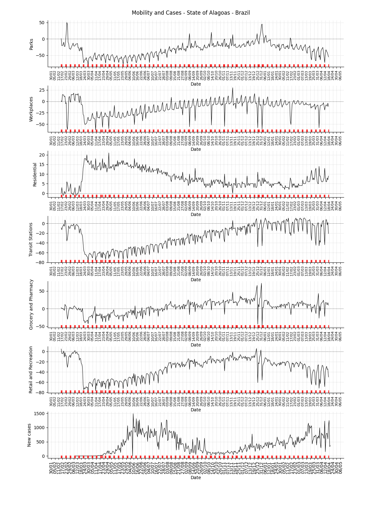

.. rubric:: Facebook symptom survey for the state

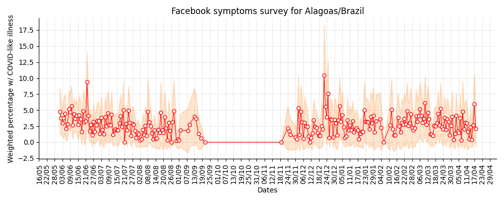

.. note:: This plot uses official data from Brazilian government as well as
          mobility data from Google Community Mobility Reports. The red markers
          on the x-axis are weekends or holidays. This plot also uses data from
          the Facebook Symptom survey data kindly hosted by University of Maryland.

**State**: Amazonas / AM
===============================================================================
.. rubric:: R(t) estimate, incidence and accumulated cases

.. image:: _static/br/r0_estim/state_am.png
  :width: 900

.. rubric:: Mobility data for the state

.. image:: _static/br/r0_estim/mobility_state_am.png
  :width: 1000

.. rubric:: Facebook symptom survey for the state

.. image:: _static/br/facebook_survey/state_am.png
  :width: 1000

.. note:: This plot uses official data from Brazilian government as well as
          mobility data from Google Community Mobility Reports. The red markers
          on the x-axis are weekends or holidays. This plot also uses data from
          the Facebook Symptom survey data kindly hosted by University of Maryland.

**State**: Amapá / AP
===============================================================================
.. rubric:: R(t) estimate, incidence and accumulated cases

.. image:: _static/br/r0_estim/state_ap.png
  :width: 900

.. rubric:: Mobility data for the state

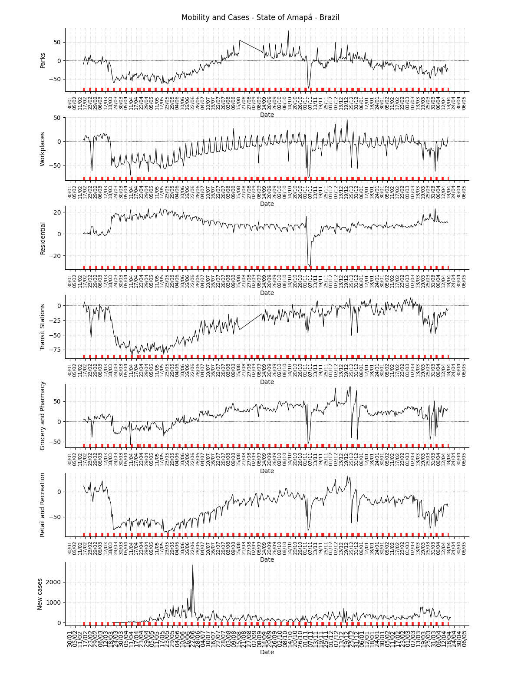

.. rubric:: Facebook symptom survey for the state

.. image:: _static/br/facebook_survey/state_ap.png
  :width: 1000

.. note:: This plot uses official data from Brazilian government as well as
          mobility data from Google Community Mobility Reports. The red markers
          on the x-axis are weekends or holidays. This plot also uses data from
          the Facebook Symptom survey data kindly hosted by University of Maryland.

**State**: Bahia / BA
===============================================================================
.. rubric:: R(t) estimate, incidence and accumulated cases

.. image:: _static/br/r0_estim/state_ba.png
  :width: 900

.. rubric:: Mobility data for the state

.. image:: _static/br/r0_estim/mobility_state_ba.png
  :width: 1000

.. rubric:: Facebook symptom survey for the state

.. image:: _static/br/facebook_survey/state_ba.png
  :width: 1000

.. note:: This plot uses official data from Brazilian government as well as
          mobility data from Google Community Mobility Reports. The red markers
          on the x-axis are weekends or holidays. This plot also uses data from
          the Facebook Symptom survey data kindly hosted by University of Maryland.

**State**: Ceará / CE
===============================================================================
.. rubric:: R(t) estimate, incidence and accumulated cases

.. image:: _static/br/r0_estim/state_ce.png
  :width: 900

.. rubric:: Mobility data for the state

.. image:: _static/br/r0_estim/mobility_state_ce.png
  :width: 1000

.. rubric:: Facebook symptom survey for the state

.. image:: _static/br/facebook_survey/state_ce.png
  :width: 1000

.. note:: This plot uses official data from Brazilian government as well as
          mobility data from Google Community Mobility Reports. The red markers
          on the x-axis are weekends or holidays. This plot also uses data from
          the Facebook Symptom survey data kindly hosted by University of Maryland.

**State**: Distrito Federal / DF
===============================================================================
.. rubric:: R(t) estimate, incidence and accumulated cases

.. image:: _static/br/r0_estim/state_df.png
  :width: 900

.. rubric:: Mobility data for the state

.. image:: _static/br/r0_estim/mobility_state_df.png
  :width: 1000

.. rubric:: Facebook symptom survey for the state

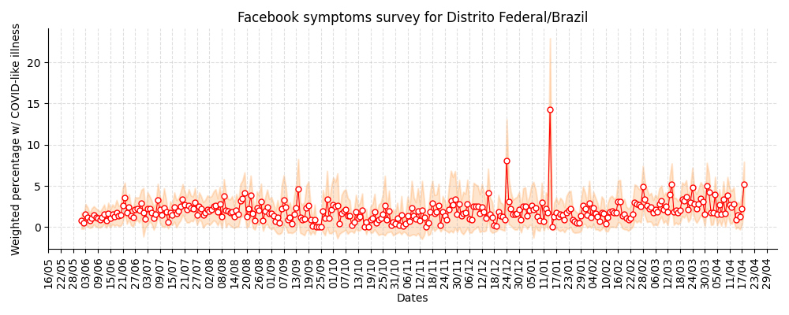

.. note:: This plot uses official data from Brazilian government as well as
          mobility data from Google Community Mobility Reports. The red markers
          on the x-axis are weekends or holidays. This plot also uses data from
          the Facebook Symptom survey data kindly hosted by University of Maryland.

**State**: Espírito Santo / ES
===============================================================================
.. rubric:: R(t) estimate, incidence and accumulated cases

.. image:: _static/br/r0_estim/state_es.png
  :width: 900

.. rubric:: Mobility data for the state

.. image:: _static/br/r0_estim/mobility_state_es.png
  :width: 1000

.. rubric:: Facebook symptom survey for the state

.. image:: _static/br/facebook_survey/state_es.png
  :width: 1000

.. note:: This plot uses official data from Brazilian government as well as
          mobility data from Google Community Mobility Reports. The red markers
          on the x-axis are weekends or holidays. This plot also uses data from
          the Facebook Symptom survey data kindly hosted by University of Maryland.

**State**: Goiás / GO
===============================================================================
.. rubric:: R(t) estimate, incidence and accumulated cases

.. image:: _static/br/r0_estim/state_go.png
  :width: 900

.. rubric:: Mobility data for the state

.. image:: _static/br/r0_estim/mobility_state_go.png
  :width: 1000

.. rubric:: Facebook symptom survey for the state

.. image:: _static/br/facebook_survey/state_go.png
  :width: 1000

.. note:: This plot uses official data from Brazilian government as well as
          mobility data from Google Community Mobility Reports. The red markers
          on the x-axis are weekends or holidays. This plot also uses data from
          the Facebook Symptom survey data kindly hosted by University of Maryland.

**State**: Maranhão / MA
===============================================================================
.. rubric:: R(t) estimate, incidence and accumulated cases

.. image:: _static/br/r0_estim/state_ma.png
  :width: 900

.. rubric:: Mobility data for the state

.. image:: _static/br/r0_estim/mobility_state_ma.png
  :width: 1000

.. rubric:: Facebook symptom survey for the state

.. image:: _static/br/facebook_survey/state_ma.png
  :width: 1000

.. note:: This plot uses official data from Brazilian government as well as
          mobility data from Google Community Mobility Reports. The red markers
          on the x-axis are weekends or holidays. This plot also uses data from
          the Facebook Symptom survey data kindly hosted by University of Maryland.

**State**: Minas Gerais / MG
===============================================================================
.. rubric:: R(t) estimate, incidence and accumulated cases

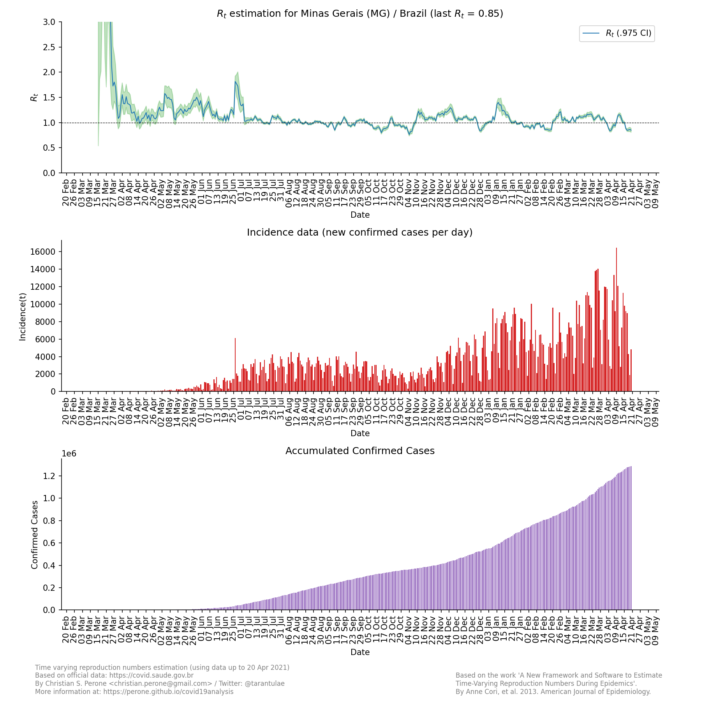

.. rubric:: Mobility data for the state

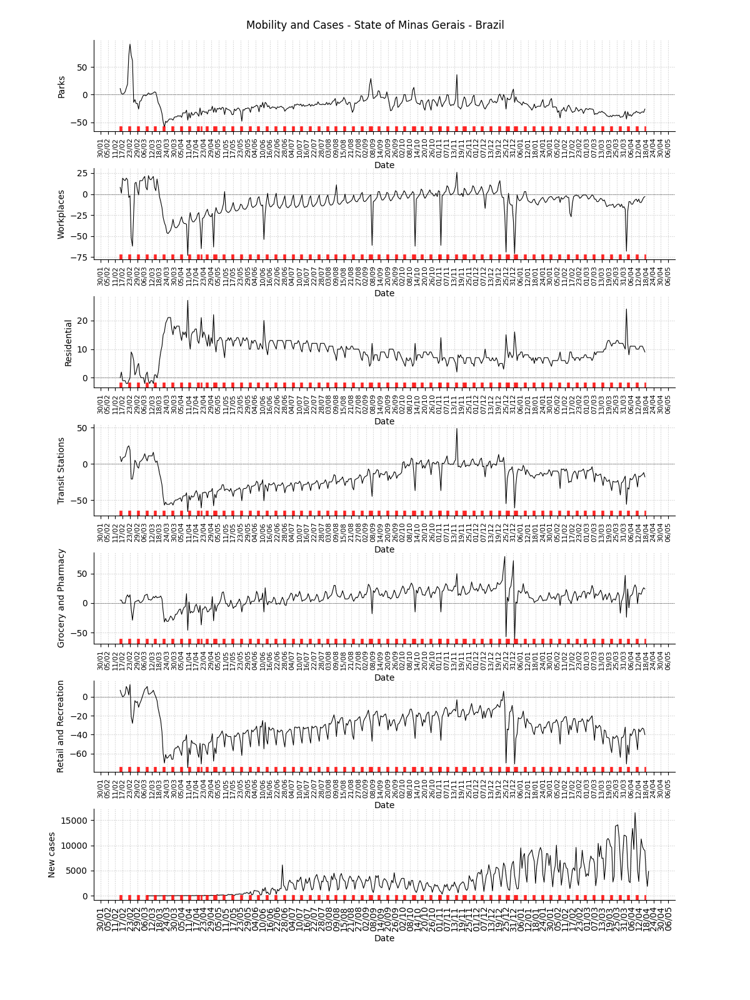

.. rubric:: Facebook symptom survey for the state

.. image:: _static/br/facebook_survey/state_mg.png
  :width: 1000

.. note:: This plot uses official data from Brazilian government as well as
          mobility data from Google Community Mobility Reports. The red markers
          on the x-axis are weekends or holidays. This plot also uses data from
          the Facebook Symptom survey data kindly hosted by University of Maryland.

**State**: Mato Grosso do Sul / MS
===============================================================================
.. rubric:: R(t) estimate, incidence and accumulated cases

.. image:: _static/br/r0_estim/state_ms.png
  :width: 900

.. rubric:: Mobility data for the state

.. image:: _static/br/r0_estim/mobility_state_ms.png
  :width: 1000

.. rubric:: Facebook symptom survey for the state

.. image:: _static/br/facebook_survey/state_ms.png
  :width: 1000

.. note:: This plot uses official data from Brazilian government as well as
          mobility data from Google Community Mobility Reports. The red markers
          on the x-axis are weekends or holidays. This plot also uses data from
          the Facebook Symptom survey data kindly hosted by University of Maryland.

**State**: Mato Grosso / MT
===============================================================================
.. rubric:: R(t) estimate, incidence and accumulated cases

.. image:: _static/br/r0_estim/state_mt.png
  :width: 900

.. rubric:: Mobility data for the state

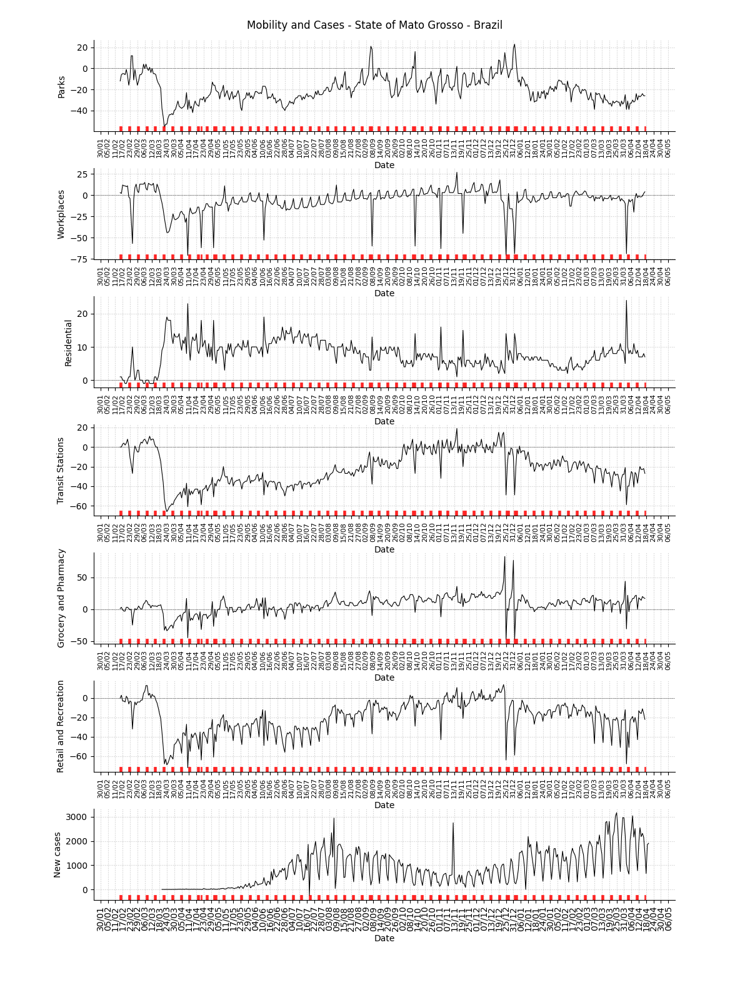

.. rubric:: Facebook symptom survey for the state

.. image:: _static/br/facebook_survey/state_mt.png
  :width: 1000

.. note:: This plot uses official data from Brazilian government as well as
          mobility data from Google Community Mobility Reports. The red markers
          on the x-axis are weekends or holidays. This plot also uses data from
          the Facebook Symptom survey data kindly hosted by University of Maryland.

**State**: Pará / PA
===============================================================================
.. rubric:: R(t) estimate, incidence and accumulated cases

.. image:: _static/br/r0_estim/state_pa.png
  :width: 900

.. rubric:: Mobility data for the state

.. image:: _static/br/r0_estim/mobility_state_pa.png
  :width: 1000

.. rubric:: Facebook symptom survey for the state

.. image:: _static/br/facebook_survey/state_pa.png
  :width: 1000

.. note:: This plot uses official data from Brazilian government as well as
          mobility data from Google Community Mobility Reports. The red markers
          on the x-axis are weekends or holidays. This plot also uses data from
          the Facebook Symptom survey data kindly hosted by University of Maryland.

**State**: Paraíba / PB
===============================================================================
.. rubric:: R(t) estimate, incidence and accumulated cases

.. image:: _static/br/r0_estim/state_pb.png
  :width: 900

.. rubric:: Mobility data for the state

.. image:: _static/br/r0_estim/mobility_state_pb.png
  :width: 1000

.. rubric:: Facebook symptom survey for the state

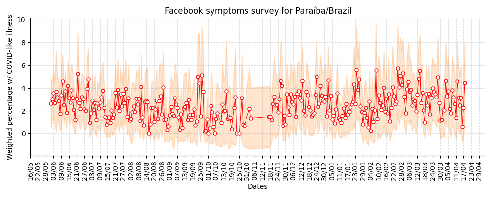

.. note:: This plot uses official data from Brazilian government as well as
          mobility data from Google Community Mobility Reports. The red markers
          on the x-axis are weekends or holidays. This plot also uses data from
          the Facebook Symptom survey data kindly hosted by University of Maryland.

**State**: Pernambuco / PE
===============================================================================
.. rubric:: R(t) estimate, incidence and accumulated cases

.. image:: _static/br/r0_estim/state_pe.png
  :width: 900

.. rubric:: Mobility data for the state

.. image:: _static/br/r0_estim/mobility_state_pe.png
  :width: 1000

.. rubric:: Facebook symptom survey for the state

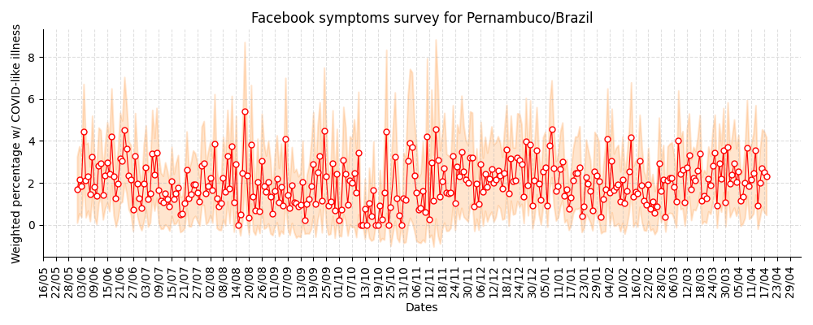

.. note:: This plot uses official data from Brazilian government as well as
          mobility data from Google Community Mobility Reports. The red markers
          on the x-axis are weekends or holidays. This plot also uses data from
          the Facebook Symptom survey data kindly hosted by University of Maryland.

**State**: Piauí / PI
===============================================================================
.. rubric:: R(t) estimate, incidence and accumulated cases

.. image:: _static/br/r0_estim/state_pi.png
  :width: 900

.. rubric:: Mobility data for the state

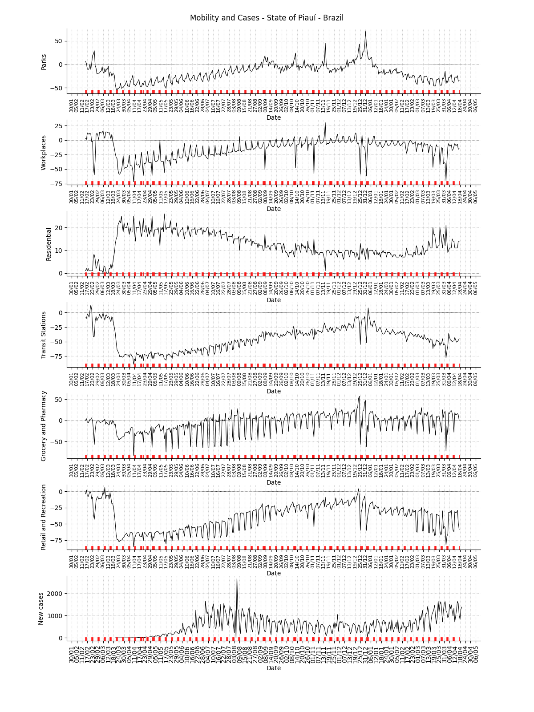

.. rubric:: Facebook symptom survey for the state

.. image:: _static/br/facebook_survey/state_pi.png
  :width: 1000

.. note:: This plot uses official data from Brazilian government as well as
          mobility data from Google Community Mobility Reports. The red markers
          on the x-axis are weekends or holidays. This plot also uses data from
          the Facebook Symptom survey data kindly hosted by University of Maryland.

**State**: Paraná / PR
===============================================================================
.. rubric:: R(t) estimate, incidence and accumulated cases

.. image:: _static/br/r0_estim/state_pr.png
  :width: 900

.. rubric:: Mobility data for the state

.. image:: _static/br/r0_estim/mobility_state_pr.png
  :width: 1000

.. rubric:: Facebook symptom survey for the state

.. image:: _static/br/facebook_survey/state_pr.png
  :width: 1000

.. note:: This plot uses official data from Brazilian government as well as
          mobility data from Google Community Mobility Reports. The red markers
          on the x-axis are weekends or holidays. This plot also uses data from
          the Facebook Symptom survey data kindly hosted by University of Maryland.

**State**: Rio de Janeiro / RJ
===============================================================================
.. rubric:: R(t) estimate, incidence and accumulated cases

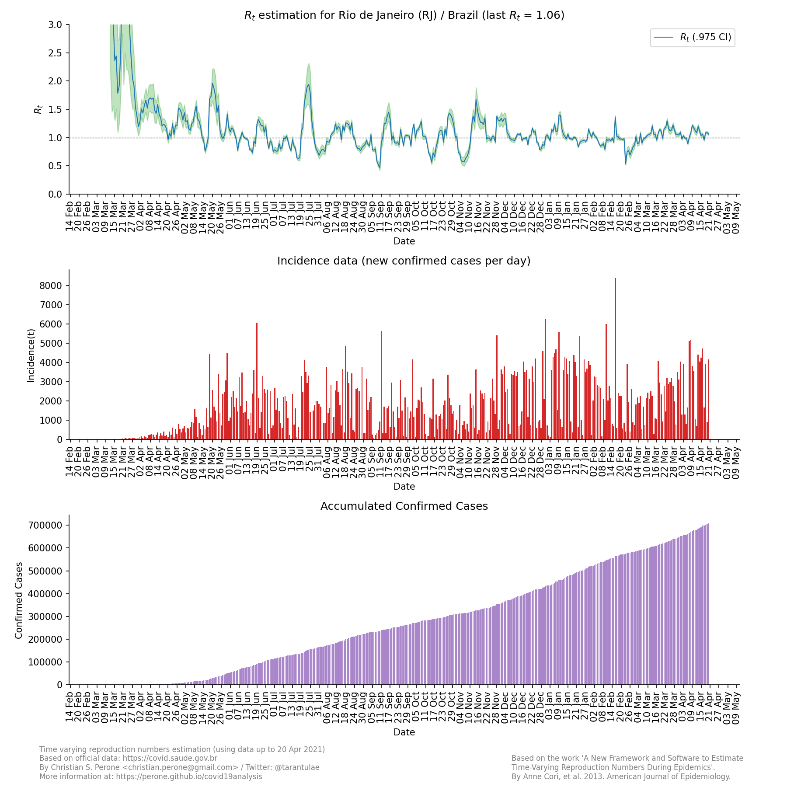

.. rubric:: Mobility data for the state

.. image:: _static/br/r0_estim/mobility_state_rj.png
  :width: 1000

.. rubric:: Facebook symptom survey for the state

.. image:: _static/br/facebook_survey/state_rj.png
  :width: 1000

.. note:: This plot uses official data from Brazilian government as well as
          mobility data from Google Community Mobility Reports. The red markers
          on the x-axis are weekends or holidays. This plot also uses data from
          the Facebook Symptom survey data kindly hosted by University of Maryland.

**State**: Rio Grande do Norte / RN
===============================================================================
.. rubric:: R(t) estimate, incidence and accumulated cases

.. image:: _static/br/r0_estim/state_rn.png
  :width: 900

.. rubric:: Mobility data for the state

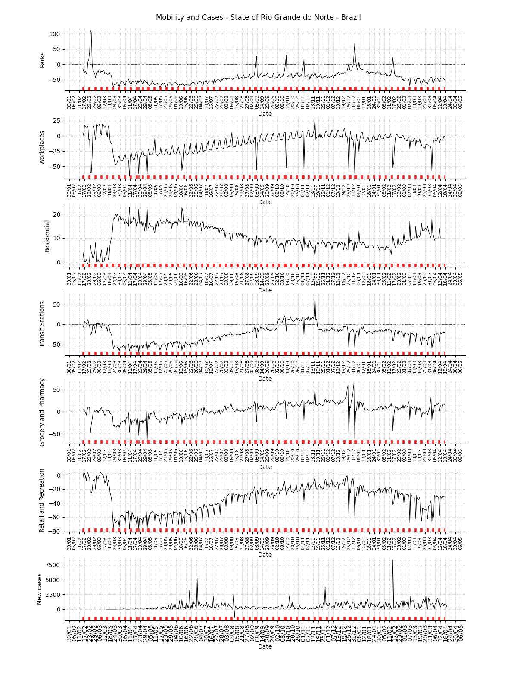

.. rubric:: Facebook symptom survey for the state

.. image:: _static/br/facebook_survey/state_rn.png
  :width: 1000

.. note:: This plot uses official data from Brazilian government as well as
          mobility data from Google Community Mobility Reports. The red markers
          on the x-axis are weekends or holidays. This plot also uses data from
          the Facebook Symptom survey data kindly hosted by University of Maryland.

**State**: Rondônia / RO
===============================================================================
.. rubric:: R(t) estimate, incidence and accumulated cases

.. image:: _static/br/r0_estim/state_ro.png
  :width: 900

.. rubric:: Mobility data for the state

.. image:: _static/br/r0_estim/mobility_state_ro.png
  :width: 1000

.. rubric:: Facebook symptom survey for the state

.. image:: _static/br/facebook_survey/state_ro.png
  :width: 1000

.. note:: This plot uses official data from Brazilian government as well as
          mobility data from Google Community Mobility Reports. The red markers
          on the x-axis are weekends or holidays. This plot also uses data from
          the Facebook Symptom survey data kindly hosted by University of Maryland.

**State**: Roraima / RR
===============================================================================
.. rubric:: R(t) estimate, incidence and accumulated cases

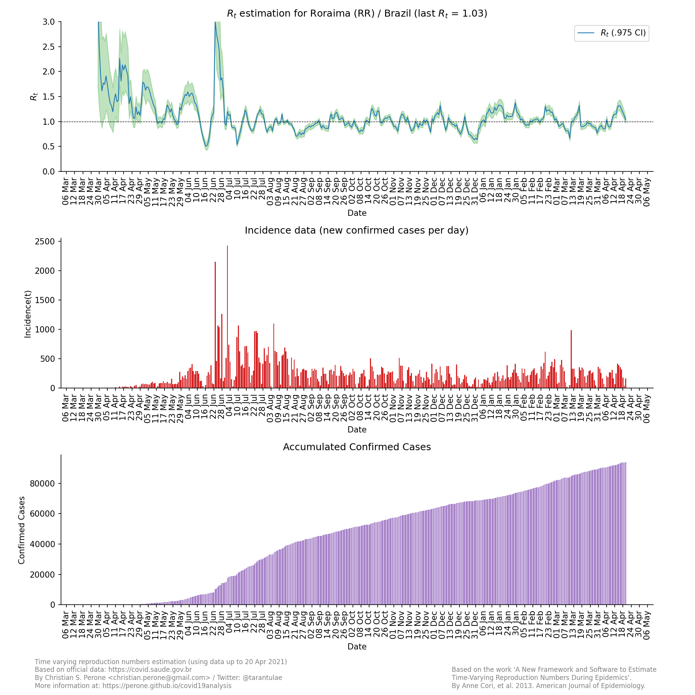

.. rubric:: Mobility data for the state

.. image:: _static/br/r0_estim/mobility_state_rr.png
  :width: 1000

.. rubric:: Facebook symptom survey for the state

.. image:: _static/br/facebook_survey/state_rr.png
  :width: 1000

.. note:: This plot uses official data from Brazilian government as well as
          mobility data from Google Community Mobility Reports. The red markers
          on the x-axis are weekends or holidays. This plot also uses data from
          the Facebook Symptom survey data kindly hosted by University of Maryland.

**State**: Rio Grande do Sul / RS
===============================================================================
.. rubric:: R(t) estimate, incidence and accumulated cases

.. image:: _static/br/r0_estim/state_rs.png
  :width: 900

.. rubric:: Mobility data for the state

.. image:: _static/br/r0_estim/mobility_state_rs.png
  :width: 1000

.. rubric:: Facebook symptom survey for the state

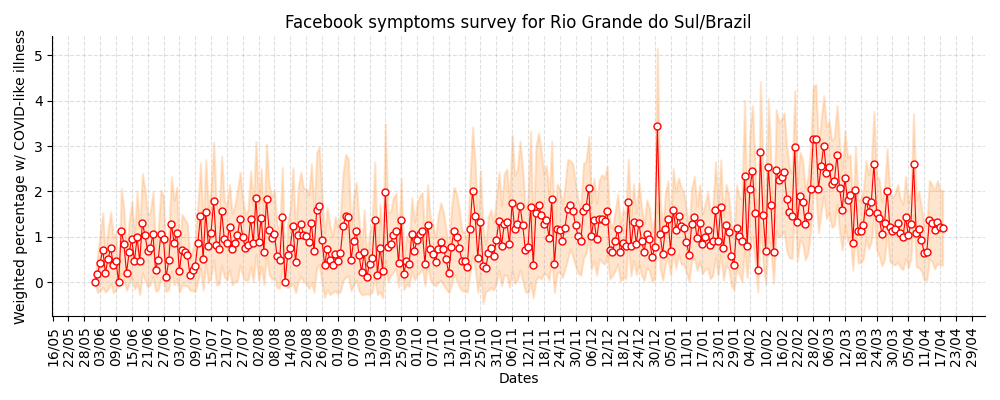

.. note:: This plot uses official data from Brazilian government as well as
          mobility data from Google Community Mobility Reports. The red markers
          on the x-axis are weekends or holidays. This plot also uses data from
          the Facebook Symptom survey data kindly hosted by University of Maryland.

**State**: Santa Catarina / SC
===============================================================================
.. rubric:: R(t) estimate, incidence and accumulated cases

.. image:: _static/br/r0_estim/state_sc.png
  :width: 900

.. rubric:: Mobility data for the state

.. image:: _static/br/r0_estim/mobility_state_sc.png
  :width: 1000

.. rubric:: Facebook symptom survey for the state

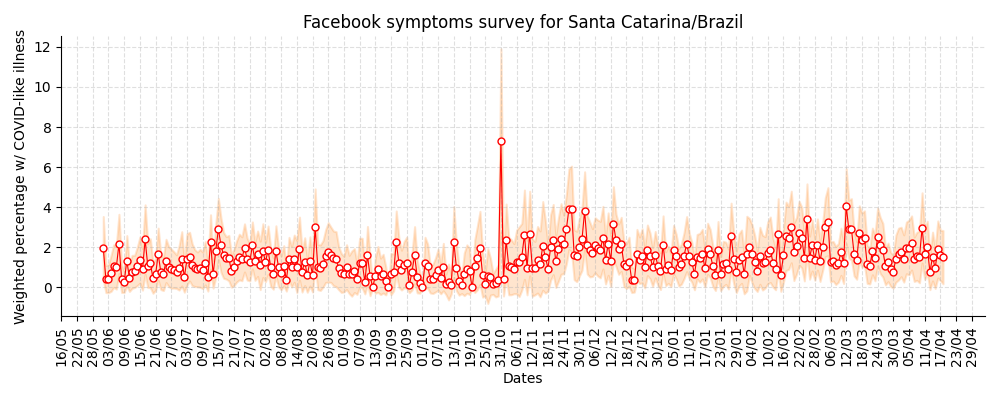

.. note:: This plot uses official data from Brazilian government as well as
          mobility data from Google Community Mobility Reports. The red markers
          on the x-axis are weekends or holidays. This plot also uses data from
          the Facebook Symptom survey data kindly hosted by University of Maryland.

**State**: Sergipe / SE
===============================================================================
.. rubric:: R(t) estimate, incidence and accumulated cases

.. image:: _static/br/r0_estim/state_se.png
  :width: 900

.. rubric:: Mobility data for the state

.. image:: _static/br/r0_estim/mobility_state_se.png
  :width: 1000

.. rubric:: Facebook symptom survey for the state

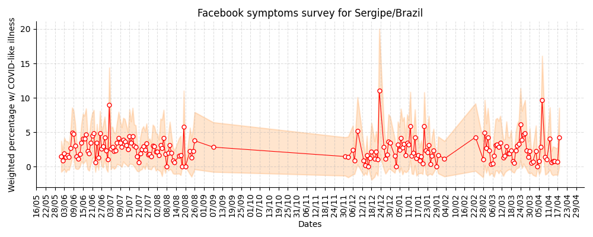

.. note:: This plot uses official data from Brazilian government as well as
          mobility data from Google Community Mobility Reports. The red markers
          on the x-axis are weekends or holidays. This plot also uses data from
          the Facebook Symptom survey data kindly hosted by University of Maryland.

**State**: São Paulo / SP
===============================================================================
.. rubric:: R(t) estimate, incidence and accumulated cases

.. image:: _static/br/r0_estim/state_sp.png
  :width: 900

.. rubric:: Mobility data for the state

.. image:: _static/br/r0_estim/mobility_state_sp.png
  :width: 1000

.. rubric:: Facebook symptom survey for the state

.. image:: _static/br/facebook_survey/state_sp.png
  :width: 1000

.. note:: This plot uses official data from Brazilian government as well as
          mobility data from Google Community Mobility Reports. The red markers
          on the x-axis are weekends or holidays. This plot also uses data from
          the Facebook Symptom survey data kindly hosted by University of Maryland.

**State**: Tocantins / TO
===============================================================================
.. rubric:: R(t) estimate, incidence and accumulated cases

.. image:: _static/br/r0_estim/state_to.png
  :width: 900

.. rubric:: Mobility data for the state

.. image:: _static/br/r0_estim/mobility_state_to.png
  :width: 1000

.. rubric:: Facebook symptom survey for the state

.. image:: _static/br/facebook_survey/state_to.png
  :width: 1000

.. note:: This plot uses official data from Brazilian government as well as
          mobility data from Google Community Mobility Reports. The red markers
          on the x-axis are weekends or holidays. This plot also uses data from
          the Facebook Symptom survey data kindly hosted by University of Maryland.

