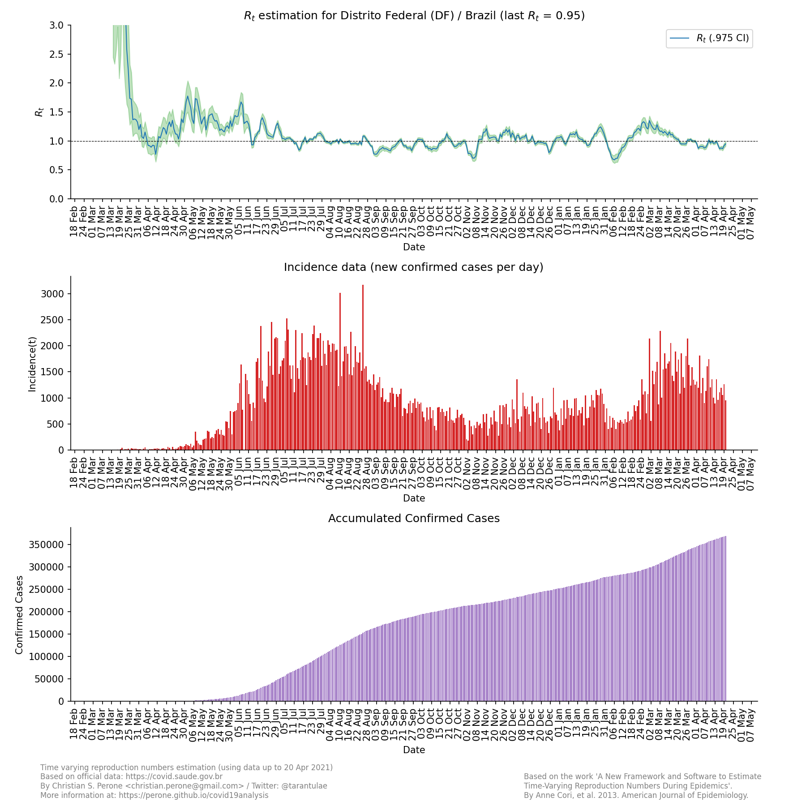
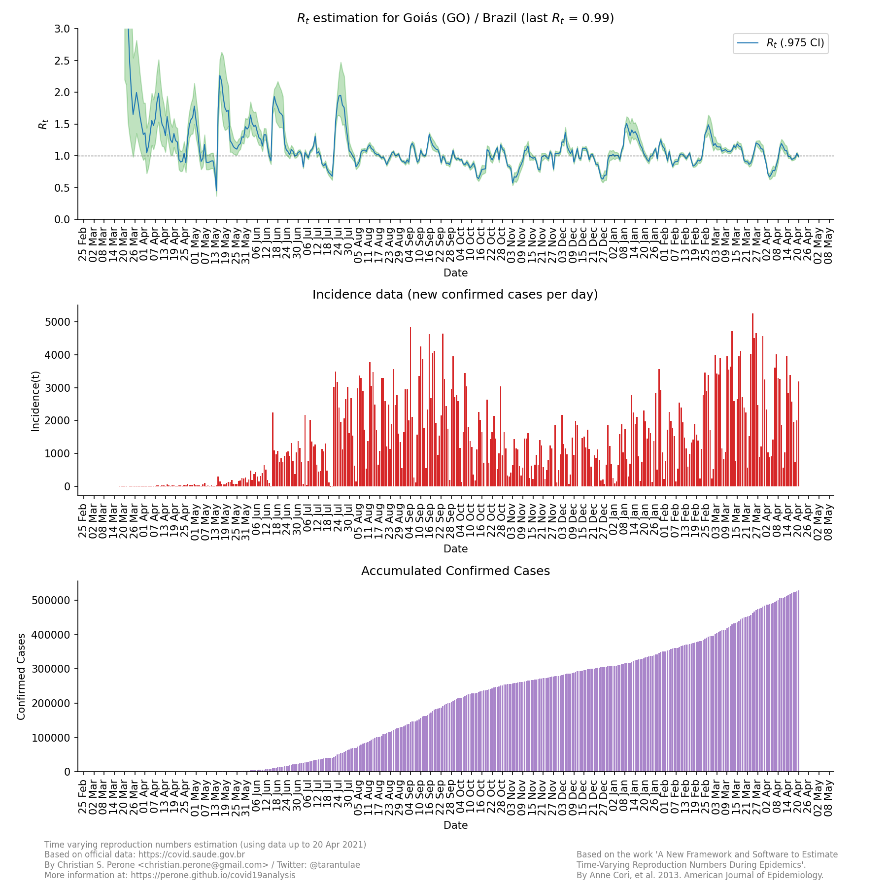
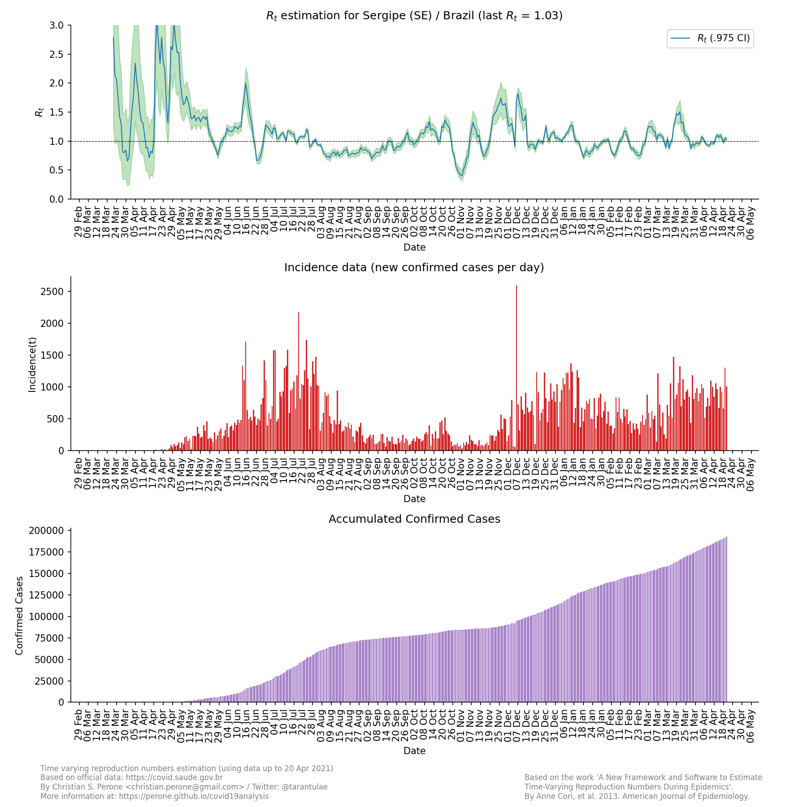

COVID-19 Time varying reproduction numbers estimation for Brazil
*******************************************************************************
This section contains analysis done for Brazil.

These plots show the estimation of the instantaneous reproduction number for all
the states in Brazil. These reports uses the method described in the work 
`A New Framework and Software to Estimate Time-Varying Reproduction Numbers During Epidemics <https://www.ncbi.nlm.nih.gov/pmc/articles/PMC3816335/>`_. We used the serial interval parameters similar to the ones used
by `CMMID <https://cmmid.github.io/topics/covid19/>`_ with a :math:`\mu = 4.7 (3.7 - 6.0)`
and :math:`\sigma = 2.9 (1.9 - 4.9)` with a log-normal distribution.

.. note:: This plot uses official data from government, reports until
          Apr 11th 2020. This method is sensitive to changes in COVID-19
          testing procedures and the level of effort used to detect cases.
          Therefore, changes in the testing efforts will introduce bias
          if the testing practices are not kept consistent. So please
          keep in mind these limitations, that are often not stated in
          many analysis around there.

**State**: Acre / AC
===============================================================================

.. image:: _static/br/r0_estim/state_ac.png
  :width: 700

**State**: Alagoas / AL
===============================================================================

.. image:: _static/br/r0_estim/state_al.png
  :width: 700

**State**: Amazonas / AM
===============================================================================

.. image:: _static/br/r0_estim/state_am.png
  :width: 700

**State**: Amapá / AP
===============================================================================

.. image:: _static/br/r0_estim/state_ap.png
  :width: 700

**State**: Bahia / BA
===============================================================================

.. image:: _static/br/r0_estim/state_ba.png
  :width: 700

**State**: Ceará / CE
===============================================================================

.. image:: _static/br/r0_estim/state_ce.png
  :width: 700

**State**: Distrito Federal / DF
===============================================================================

**State**: Espírito Santo / ES
===============================================================================

.. image:: _static/br/r0_estim/state_es.png
  :width: 700

**State**: Goiás / GO
===============================================================================

**State**: Maranhão / MA
===============================================================================

.. image:: _static/br/r0_estim/state_ma.png
  :width: 700

**State**: Minas Gerais / MG
===============================================================================

.. image:: _static/br/r0_estim/state_mg.png
  :width: 700

**State**: Mato Grosso do Sul / MS
===============================================================================

.. image:: _static/br/r0_estim/state_ms.png
  :width: 700

**State**: Mato Grosso / MT
===============================================================================

.. image:: _static/br/r0_estim/state_mt.png
  :width: 700

**State**: Pará / PA
===============================================================================

.. image:: _static/br/r0_estim/state_pa.png
  :width: 700

**State**: Paraíba / PB
===============================================================================

.. image:: _static/br/r0_estim/state_pb.png
  :width: 700

**State**: Pernambuco / PE
===============================================================================

.. image:: _static/br/r0_estim/state_pe.png
  :width: 700

**State**: Piauí / PI
===============================================================================

.. image:: _static/br/r0_estim/state_pi.png
  :width: 700

**State**: Paraná / PR
===============================================================================

.. image:: _static/br/r0_estim/state_pr.png
  :width: 700

**State**: Rio de Janeiro / RJ
===============================================================================

.. image:: _static/br/r0_estim/state_rj.png
  :width: 700

**State**: Rio Grande do Norte / RN
===============================================================================

.. image:: _static/br/r0_estim/state_rn.png
  :width: 700

**State**: Rondônia / RO
===============================================================================

.. image:: _static/br/r0_estim/state_ro.png
  :width: 700

**State**: Roraima / RR
===============================================================================

.. image:: _static/br/r0_estim/state_rr.png
  :width: 700

**State**: Rio Grande do Sul / RS
===============================================================================

.. image:: _static/br/r0_estim/state_rs.png
  :width: 700

**State**: Santa Catarina / SC
===============================================================================

.. image:: _static/br/r0_estim/state_sc.png
  :width: 700

**State**: Sergipe / SE
===============================================================================

**State**: São Paulo / SP
===============================================================================

.. image:: _static/br/r0_estim/state_sp.png
  :width: 700

**State**: Tocantins / TO
===============================================================================

.. image:: _static/br/r0_estim/state_to.png
  :width: 700

