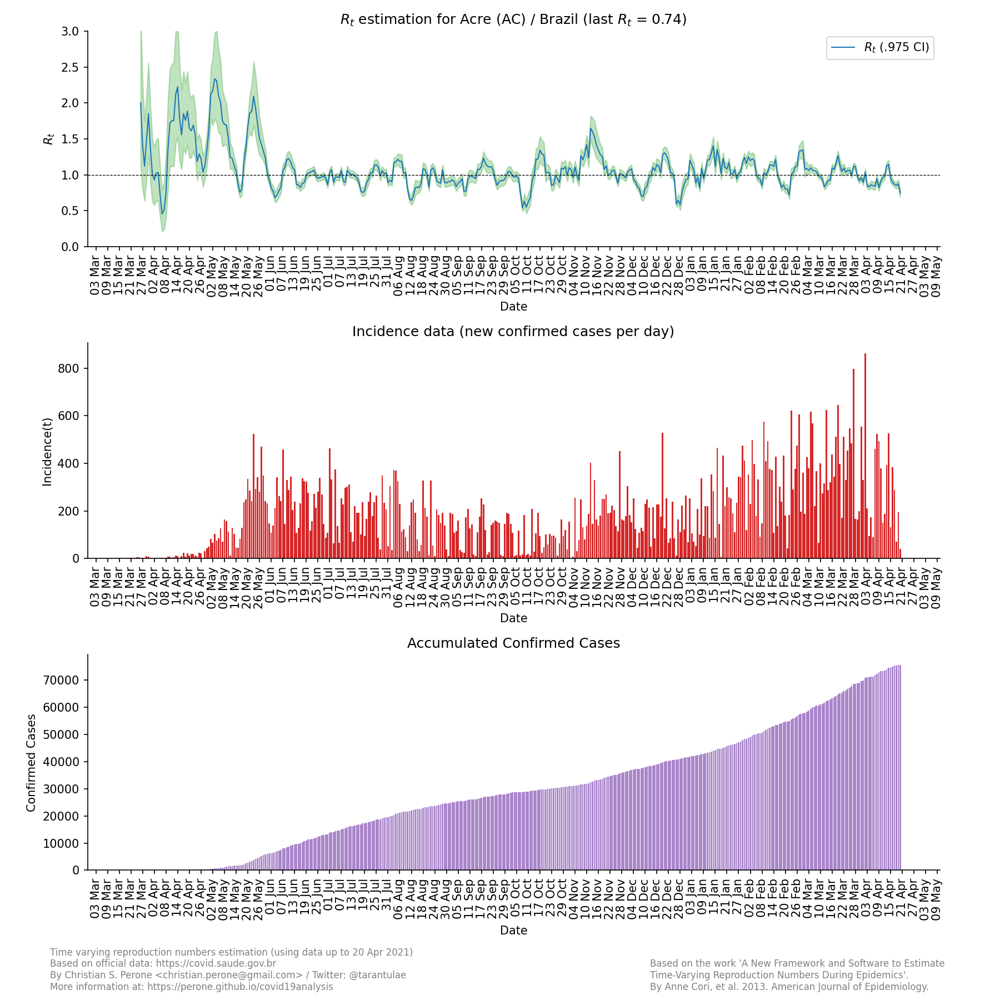
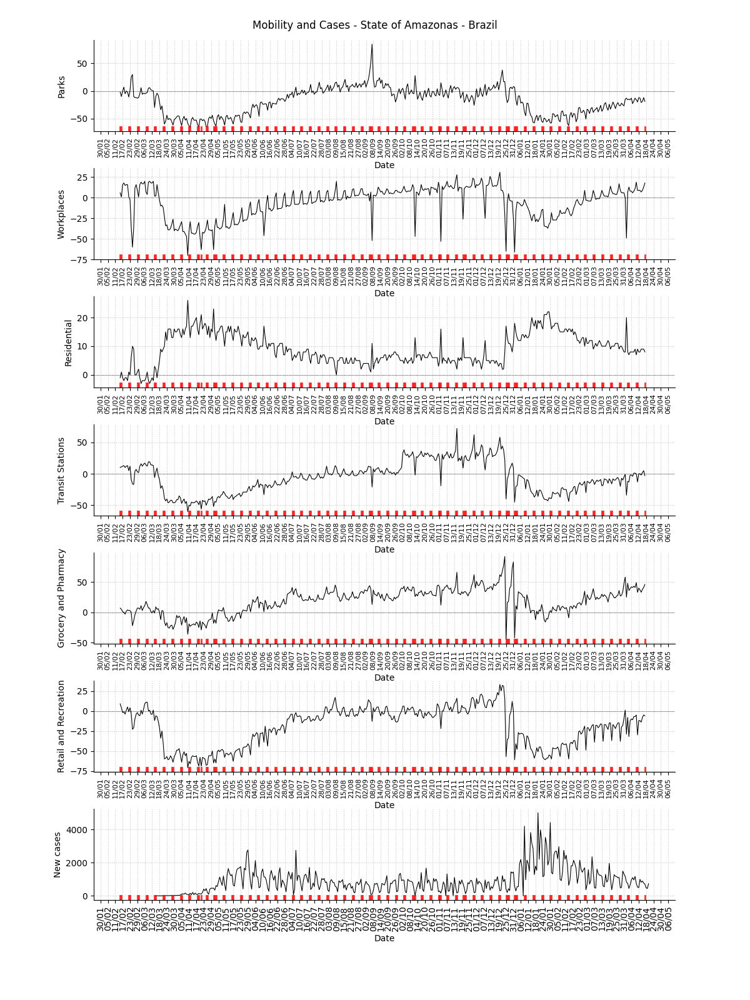
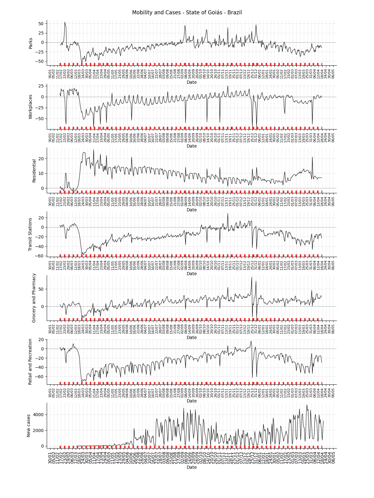
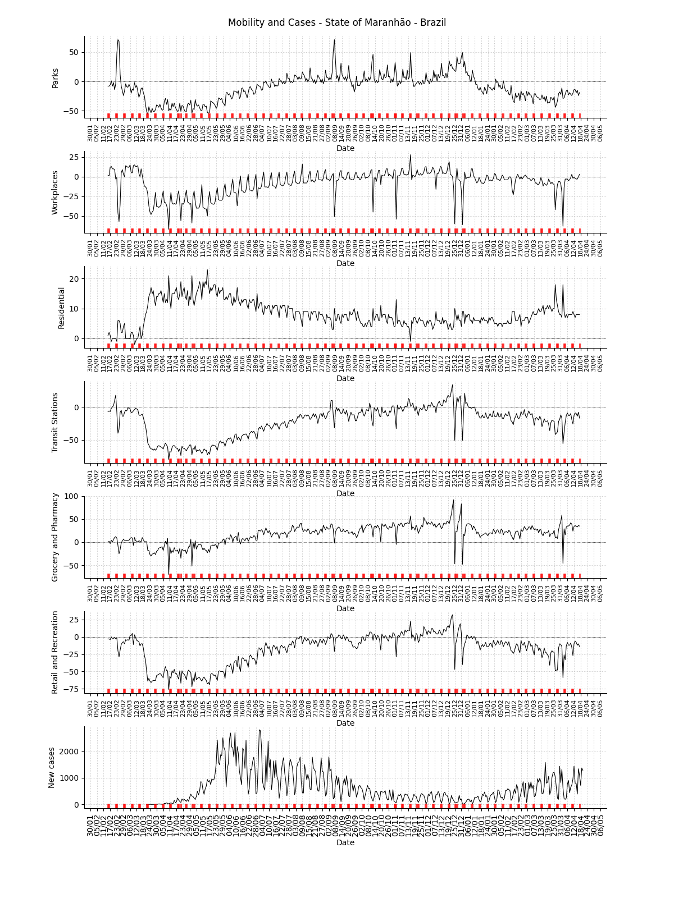
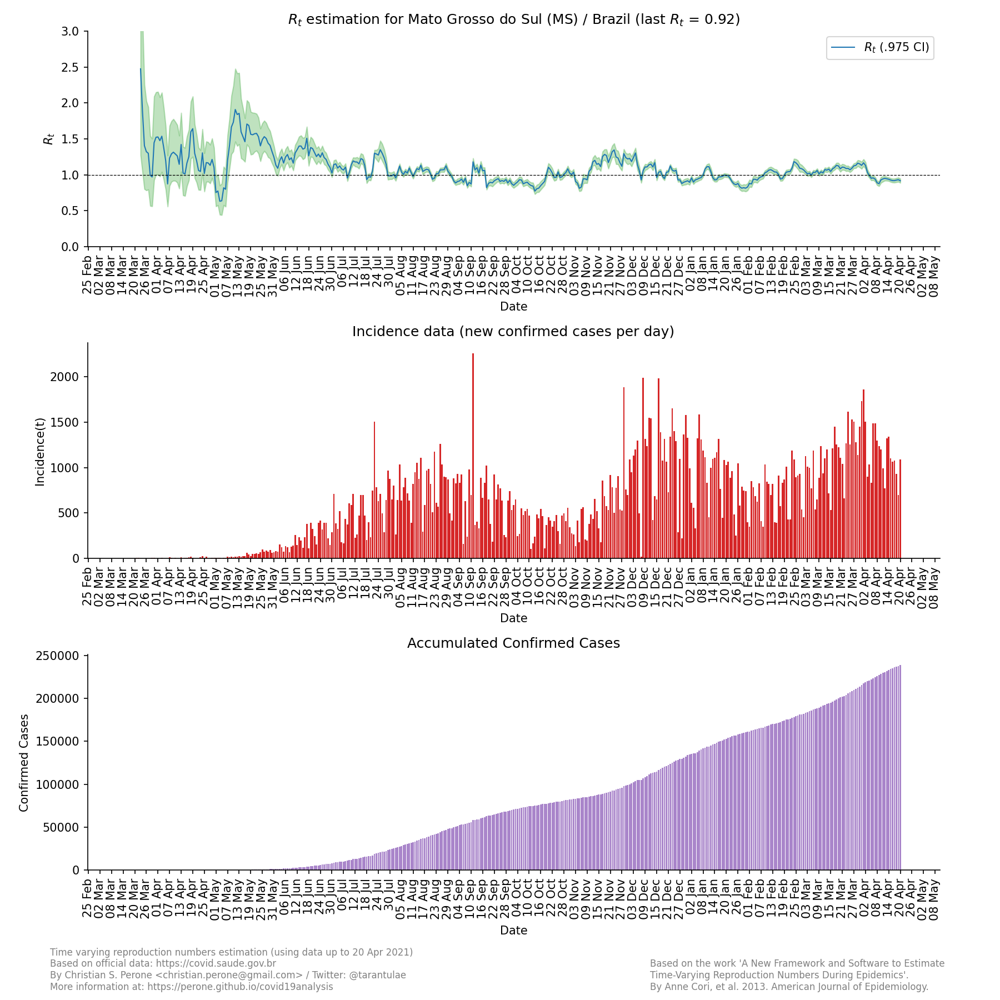
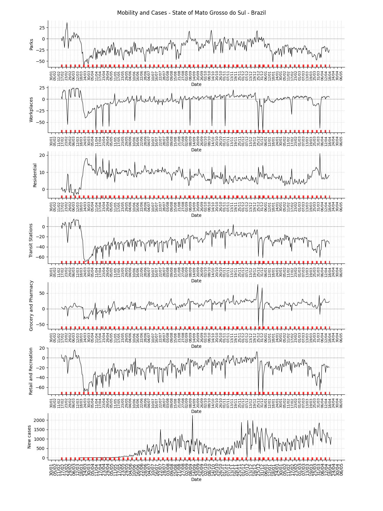
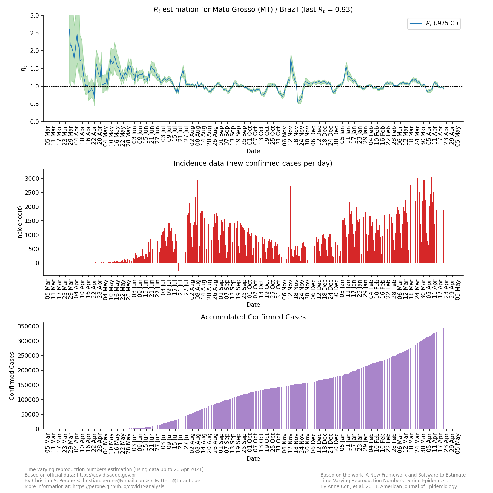
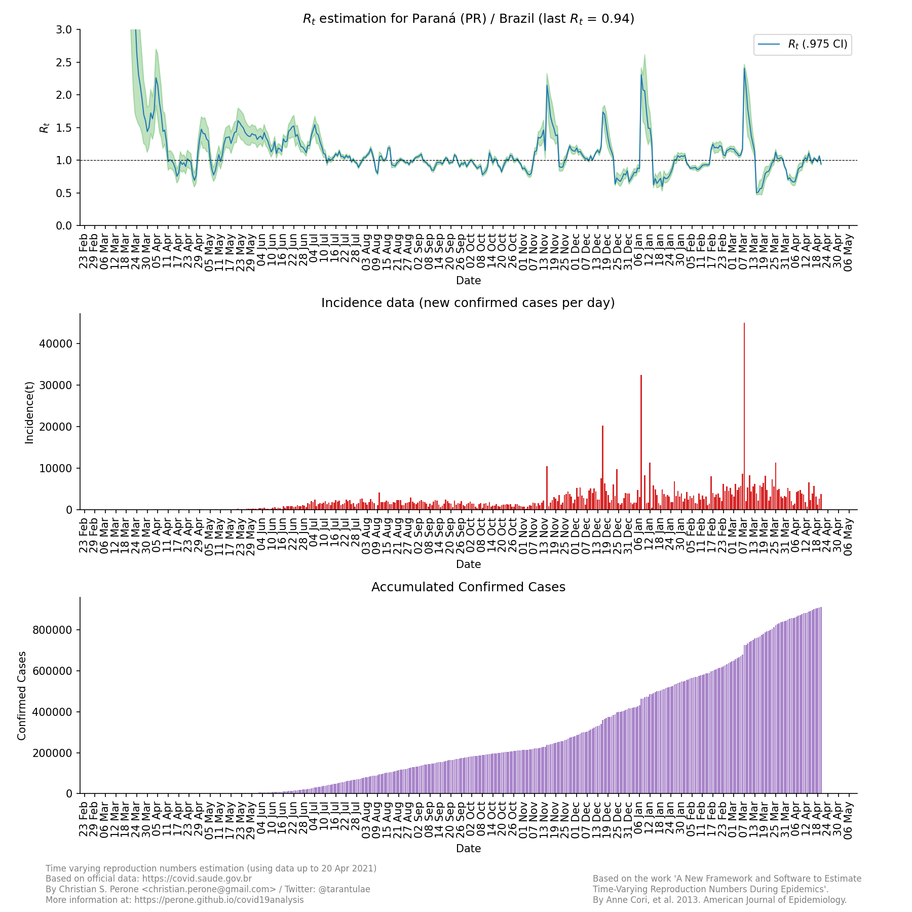
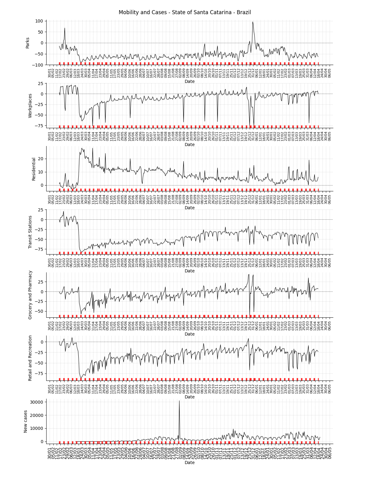

**23/May** -- COVID-19 Time varying reproduction numbers estimation for Brazil
*****************************************************************************************************
These plots show the estimation of the instantaneous reproduction number for all
the states in Brazil. These reports uses the method described in the work 
`A New Framework and Software to Estimate Time-Varying Reproduction Numbers During Epidemics <https://www.ncbi.nlm.nih.gov/pmc/articles/PMC3816335/>`_. We used the serial interval parameters similar to the ones used
by `CMMID <https://cmmid.github.io/topics/covid19/>`_ with a :math:`\mu = 4.7 (3.7 - 6.0)`
and :math:`\sigma = 2.9 (1.9 - 4.9)`.

.. note:: This plot uses official data from government, reports until
          23/May. This method is sensitive to changes in COVID-19
          testing procedures and the level of effort used to detect cases.
          Therefore, changes in the testing efforts will introduce bias
          if the testing practices are not kept consistent. So please
          keep in mind these limitations, that are often not stated in
          many analysis around there. Imported cases weren't also
          considered in this analysis, neither the delay of the symptoms
          onset and reporting.

Summary for the last instantaneous reproduction number estimate
===============================================================================
.. rubric:: Map for the accumulated cases

.. raw:: html

    <iframe src="_static/restim_cases_map.html" height="591px" width="100%" frameBorder="0"></iframe>

.. rubric:: Map for the last instantaneous reproduction number estimate

.. raw:: html

    <iframe src="_static/restim_map.html" height="591px" width="100%" frameBorder="0"></iframe>

.. rubric:: Map of states with mean reproduction number R(t) > 1.0

.. raw:: html

    <iframe src="_static/restim_badr_map.html" height="591px" width="100%" frameBorder="0"></iframe>

.. rubric:: Map for the accumulated deaths by COVID-19

.. raw:: html

    <iframe src="_static/restim_deaths_map.html" height="591px" width="100%" frameBorder="0"></iframe>

.. rubric:: Summary for the last instantaneous reproduction number estimate

Last update: **23/May**

.. image:: _static/br/r0_estim/estim_all.svg
    :width: 800

.. rubric:: Summary table for the last instantaneous reproduction number estimate

.. raw:: html
    
    

    <table class="greyGridTable">
    <thead>
    <tr>
    <th>State</th> 
    <th>Mean Estimated R (CI 0.975)</th>
    </tr>
    </thead>
    <tbody>
    
    <tr>
        <td>AC</td>
        <td>2.11 (1.73 - 2.60)</td>
    </tr>
    
    <tr>
        <td>RS</td>
        <td>1.72 (1.42 - 2.15)</td>
    </tr>
    
    <tr>
        <td>RO</td>
        <td>1.53 (1.37 - 1.72)</td>
    </tr>
    
    <tr>
        <td>AP</td>
        <td>1.53 (1.37 - 1.69)</td>
    </tr>
    
    <tr>
        <td>MS</td>
        <td>1.52 (1.29 - 1.78)</td>
    </tr>
    
    <tr>
        <td>PR</td>
        <td>1.52 (1.31 - 1.75)</td>
    </tr>
    
    <tr>
        <td>TO</td>
        <td>1.45 (1.31 - 1.60)</td>
    </tr>
    
    <tr>
        <td>PB</td>
        <td>1.45 (1.31 - 1.60)</td>
    </tr>
    
    <tr>
        <td>RJ</td>
        <td>1.43 (1.21 - 1.71)</td>
    </tr>
    
    <tr>
        <td>MA</td>
        <td>1.32 (1.24 - 1.41)</td>
    </tr>
    
    <tr>
        <td>ES</td>
        <td>1.32 (1.20 - 1.45)</td>
    </tr>
    
    <tr>
        <td>MT</td>
        <td>1.31 (1.18 - 1.45)</td>
    </tr>
    
    <tr>
        <td>SC</td>
        <td>1.30 (1.22 - 1.38)</td>
    </tr>
    
    <tr>
        <td>PA</td>
        <td>1.29 (1.19 - 1.40)</td>
    </tr>
    
    <tr>
        <td>MG</td>
        <td>1.27 (1.18 - 1.38)</td>
    </tr>
    
    <tr>
        <td>RN</td>
        <td>1.26 (1.16 - 1.38)</td>
    </tr>
    
    <tr>
        <td>AL</td>
        <td>1.25 (1.14 - 1.36)</td>
    </tr>
    
    <tr>
        <td>PI</td>
        <td>1.23 (1.13 - 1.34)</td>
    </tr>
    
    <tr>
        <td>BA</td>
        <td>1.22 (1.11 - 1.35)</td>
    </tr>
    
    <tr>
        <td>CE</td>
        <td>1.21 (1.12 - 1.31)</td>
    </tr>
    
    <tr>
        <td>PE</td>
        <td>1.20 (1.08 - 1.32)</td>
    </tr>
    
    <tr>
        <td>DF</td>
        <td>1.18 (1.09 - 1.28)</td>
    </tr>
    
    <tr>
        <td>AM</td>
        <td>1.17 (1.14 - 1.22)</td>
    </tr>
    
    <tr>
        <td>GO</td>
        <td>1.15 (1.03 - 1.27)</td>
    </tr>
    
    <tr>
        <td>RR</td>
        <td>1.12 (1.02 - 1.24)</td>
    </tr>
    
    <tr>
        <td>SP</td>
        <td>1.11 (1.07 - 1.15)</td>
    </tr>
    
    <tr>
        <td>SE</td>
        <td>1.11 (1.02 - 1.21)</td>
    </tr>
    
    </tbody>
    </table>

**State**: Acre / AC
===============================================================================
.. rubric:: R(t) estimate, incidence and accumulated cases

.. rubric:: Mobility data for the state

.. image:: _static/br/r0_estim/mobility_state_ac.png
  :width: 1000

.. note:: This plot uses official data from Brazilian government as well as
          mobility data from Google Community Mobility Reports. The red markers
          on the x-axis are weekends or holidays.

**State**: Alagoas / AL
===============================================================================
.. rubric:: R(t) estimate, incidence and accumulated cases

.. image:: _static/br/r0_estim/state_al.png
  :width: 900

.. rubric:: Mobility data for the state

.. image:: _static/br/r0_estim/mobility_state_al.png
  :width: 1000

.. note:: This plot uses official data from Brazilian government as well as
          mobility data from Google Community Mobility Reports. The red markers
          on the x-axis are weekends or holidays.

**State**: Amazonas / AM
===============================================================================
.. rubric:: R(t) estimate, incidence and accumulated cases

.. image:: _static/br/r0_estim/state_am.png
  :width: 900

.. rubric:: Mobility data for the state

.. note:: This plot uses official data from Brazilian government as well as
          mobility data from Google Community Mobility Reports. The red markers
          on the x-axis are weekends or holidays.

**State**: Amapá / AP
===============================================================================
.. rubric:: R(t) estimate, incidence and accumulated cases

.. image:: _static/br/r0_estim/state_ap.png
  :width: 900

.. rubric:: Mobility data for the state

.. image:: _static/br/r0_estim/mobility_state_ap.png
  :width: 1000

.. note:: This plot uses official data from Brazilian government as well as
          mobility data from Google Community Mobility Reports. The red markers
          on the x-axis are weekends or holidays.

**State**: Bahia / BA
===============================================================================
.. rubric:: R(t) estimate, incidence and accumulated cases

.. image:: _static/br/r0_estim/state_ba.png
  :width: 900

.. rubric:: Mobility data for the state

.. image:: _static/br/r0_estim/mobility_state_ba.png
  :width: 1000

.. note:: This plot uses official data from Brazilian government as well as
          mobility data from Google Community Mobility Reports. The red markers
          on the x-axis are weekends or holidays.

**State**: Ceará / CE
===============================================================================
.. rubric:: R(t) estimate, incidence and accumulated cases

.. image:: _static/br/r0_estim/state_ce.png
  :width: 900

.. rubric:: Mobility data for the state

.. image:: _static/br/r0_estim/mobility_state_ce.png
  :width: 1000

.. note:: This plot uses official data from Brazilian government as well as
          mobility data from Google Community Mobility Reports. The red markers
          on the x-axis are weekends or holidays.

**State**: Distrito Federal / DF
===============================================================================
.. rubric:: R(t) estimate, incidence and accumulated cases

.. image:: _static/br/r0_estim/state_df.png
  :width: 900

.. rubric:: Mobility data for the state

.. image:: _static/br/r0_estim/mobility_state_df.png
  :width: 1000

.. note:: This plot uses official data from Brazilian government as well as
          mobility data from Google Community Mobility Reports. The red markers
          on the x-axis are weekends or holidays.

**State**: Espírito Santo / ES
===============================================================================
.. rubric:: R(t) estimate, incidence and accumulated cases

.. image:: _static/br/r0_estim/state_es.png
  :width: 900

.. rubric:: Mobility data for the state

.. image:: _static/br/r0_estim/mobility_state_es.png
  :width: 1000

.. note:: This plot uses official data from Brazilian government as well as
          mobility data from Google Community Mobility Reports. The red markers
          on the x-axis are weekends or holidays.

**State**: Goiás / GO
===============================================================================
.. rubric:: R(t) estimate, incidence and accumulated cases

.. image:: _static/br/r0_estim/state_go.png
  :width: 900

.. rubric:: Mobility data for the state

.. note:: This plot uses official data from Brazilian government as well as
          mobility data from Google Community Mobility Reports. The red markers
          on the x-axis are weekends or holidays.

**State**: Maranhão / MA
===============================================================================
.. rubric:: R(t) estimate, incidence and accumulated cases

.. image:: _static/br/r0_estim/state_ma.png
  :width: 900

.. rubric:: Mobility data for the state

.. note:: This plot uses official data from Brazilian government as well as
          mobility data from Google Community Mobility Reports. The red markers
          on the x-axis are weekends or holidays.

**State**: Minas Gerais / MG
===============================================================================
.. rubric:: R(t) estimate, incidence and accumulated cases

.. image:: _static/br/r0_estim/state_mg.png
  :width: 900

.. rubric:: Mobility data for the state

.. image:: _static/br/r0_estim/mobility_state_mg.png
  :width: 1000

.. note:: This plot uses official data from Brazilian government as well as
          mobility data from Google Community Mobility Reports. The red markers
          on the x-axis are weekends or holidays.

**State**: Mato Grosso do Sul / MS
===============================================================================
.. rubric:: R(t) estimate, incidence and accumulated cases

.. rubric:: Mobility data for the state

.. note:: This plot uses official data from Brazilian government as well as
          mobility data from Google Community Mobility Reports. The red markers
          on the x-axis are weekends or holidays.

**State**: Mato Grosso / MT
===============================================================================
.. rubric:: R(t) estimate, incidence and accumulated cases

.. rubric:: Mobility data for the state

.. image:: _static/br/r0_estim/mobility_state_mt.png
  :width: 1000

.. note:: This plot uses official data from Brazilian government as well as
          mobility data from Google Community Mobility Reports. The red markers
          on the x-axis are weekends or holidays.

**State**: Pará / PA
===============================================================================
.. rubric:: R(t) estimate, incidence and accumulated cases

.. image:: _static/br/r0_estim/state_pa.png
  :width: 900

.. rubric:: Mobility data for the state

.. image:: _static/br/r0_estim/mobility_state_pa.png
  :width: 1000

.. note:: This plot uses official data from Brazilian government as well as
          mobility data from Google Community Mobility Reports. The red markers
          on the x-axis are weekends or holidays.

**State**: Paraíba / PB
===============================================================================
.. rubric:: R(t) estimate, incidence and accumulated cases

.. image:: _static/br/r0_estim/state_pb.png
  :width: 900

.. rubric:: Mobility data for the state

.. image:: _static/br/r0_estim/mobility_state_pb.png
  :width: 1000

.. note:: This plot uses official data from Brazilian government as well as
          mobility data from Google Community Mobility Reports. The red markers
          on the x-axis are weekends or holidays.

**State**: Pernambuco / PE
===============================================================================
.. rubric:: R(t) estimate, incidence and accumulated cases

.. image:: _static/br/r0_estim/state_pe.png
  :width: 900

.. rubric:: Mobility data for the state

.. image:: _static/br/r0_estim/mobility_state_pe.png
  :width: 1000

.. note:: This plot uses official data from Brazilian government as well as
          mobility data from Google Community Mobility Reports. The red markers
          on the x-axis are weekends or holidays.

**State**: Piauí / PI
===============================================================================
.. rubric:: R(t) estimate, incidence and accumulated cases

.. image:: _static/br/r0_estim/state_pi.png
  :width: 900

.. rubric:: Mobility data for the state

.. image:: _static/br/r0_estim/mobility_state_pi.png
  :width: 1000

.. note:: This plot uses official data from Brazilian government as well as
          mobility data from Google Community Mobility Reports. The red markers
          on the x-axis are weekends or holidays.

**State**: Paraná / PR
===============================================================================
.. rubric:: R(t) estimate, incidence and accumulated cases

.. rubric:: Mobility data for the state

.. image:: _static/br/r0_estim/mobility_state_pr.png
  :width: 1000

.. note:: This plot uses official data from Brazilian government as well as
          mobility data from Google Community Mobility Reports. The red markers
          on the x-axis are weekends or holidays.

**State**: Rio de Janeiro / RJ
===============================================================================
.. rubric:: R(t) estimate, incidence and accumulated cases

.. image:: _static/br/r0_estim/state_rj.png
  :width: 900

.. rubric:: Mobility data for the state

.. image:: _static/br/r0_estim/mobility_state_rj.png
  :width: 1000

.. note:: This plot uses official data from Brazilian government as well as
          mobility data from Google Community Mobility Reports. The red markers
          on the x-axis are weekends or holidays.

**State**: Rio Grande do Norte / RN
===============================================================================
.. rubric:: R(t) estimate, incidence and accumulated cases

.. image:: _static/br/r0_estim/state_rn.png
  :width: 900

.. rubric:: Mobility data for the state

.. image:: _static/br/r0_estim/mobility_state_rn.png
  :width: 1000

.. note:: This plot uses official data from Brazilian government as well as
          mobility data from Google Community Mobility Reports. The red markers
          on the x-axis are weekends or holidays.

**State**: Rondônia / RO
===============================================================================
.. rubric:: R(t) estimate, incidence and accumulated cases

.. image:: _static/br/r0_estim/state_ro.png
  :width: 900

.. rubric:: Mobility data for the state

.. image:: _static/br/r0_estim/mobility_state_ro.png
  :width: 1000

.. note:: This plot uses official data from Brazilian government as well as
          mobility data from Google Community Mobility Reports. The red markers
          on the x-axis are weekends or holidays.

**State**: Roraima / RR
===============================================================================
.. rubric:: R(t) estimate, incidence and accumulated cases

.. image:: _static/br/r0_estim/state_rr.png
  :width: 900

.. rubric:: Mobility data for the state

.. image:: _static/br/r0_estim/mobility_state_rr.png
  :width: 1000

.. note:: This plot uses official data from Brazilian government as well as
          mobility data from Google Community Mobility Reports. The red markers
          on the x-axis are weekends or holidays.

**State**: Rio Grande do Sul / RS
===============================================================================
.. rubric:: R(t) estimate, incidence and accumulated cases

.. image:: _static/br/r0_estim/state_rs.png
  :width: 900

.. rubric:: Mobility data for the state

.. image:: _static/br/r0_estim/mobility_state_rs.png
  :width: 1000

.. note:: This plot uses official data from Brazilian government as well as
          mobility data from Google Community Mobility Reports. The red markers
          on the x-axis are weekends or holidays.

**State**: Santa Catarina / SC
===============================================================================
.. rubric:: R(t) estimate, incidence and accumulated cases

.. image:: _static/br/r0_estim/state_sc.png
  :width: 900

.. rubric:: Mobility data for the state

.. note:: This plot uses official data from Brazilian government as well as
          mobility data from Google Community Mobility Reports. The red markers
          on the x-axis are weekends or holidays.

**State**: Sergipe / SE
===============================================================================
.. rubric:: R(t) estimate, incidence and accumulated cases

.. image:: _static/br/r0_estim/state_se.png
  :width: 900

.. rubric:: Mobility data for the state

.. image:: _static/br/r0_estim/mobility_state_se.png
  :width: 1000

.. note:: This plot uses official data from Brazilian government as well as
          mobility data from Google Community Mobility Reports. The red markers
          on the x-axis are weekends or holidays.

**State**: São Paulo / SP
===============================================================================
.. rubric:: R(t) estimate, incidence and accumulated cases

.. image:: _static/br/r0_estim/state_sp.png
  :width: 900

.. rubric:: Mobility data for the state

.. image:: _static/br/r0_estim/mobility_state_sp.png
  :width: 1000

.. note:: This plot uses official data from Brazilian government as well as
          mobility data from Google Community Mobility Reports. The red markers
          on the x-axis are weekends or holidays.

**State**: Tocantins / TO
===============================================================================
.. rubric:: R(t) estimate, incidence and accumulated cases

.. image:: _static/br/r0_estim/state_to.png
  :width: 900

.. rubric:: Mobility data for the state

.. image:: _static/br/r0_estim/mobility_state_to.png
  :width: 1000

.. note:: This plot uses official data from Brazilian government as well as
          mobility data from Google Community Mobility Reports. The red markers
          on the x-axis are weekends or holidays.

