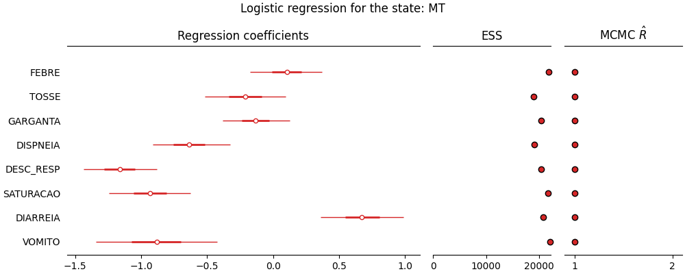
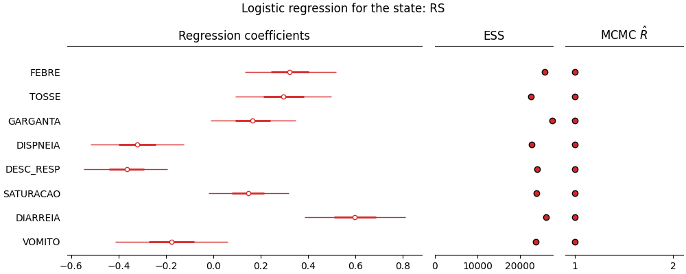
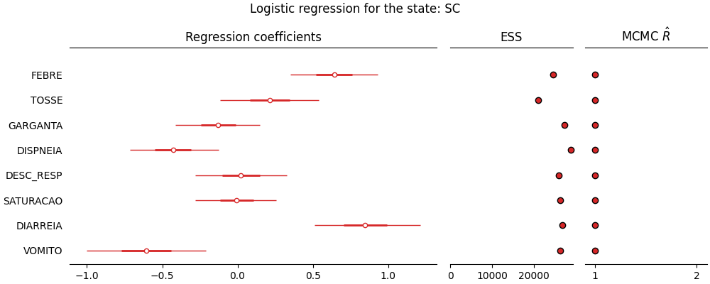

**18/May** -- Symptom regression for each state in Brazil
*****************************************************************************************************
This is a bayesian logistic regression with a bernoulli likelihood for the outcome of
the patient (positive/not positive for COVID-19) based on the reported symptoms covariates.

A HMC MCMC procedure was employed to estimate the model with 2 independent chains. On the
left panel of the plots you'll find the regression coefficients and their uncertainties. On
the middle panel you'll find the Effective Sample Size of the MCMC sampling and on the right
panel you'll find the MCMC Rhat diagnostic metric.

Some important points:

* Only states with more than 100 cases reported on SIVEP system were used in the
  estimation;
* SIVEP data doesn't include all testing done for all states and all cities;
* SIVEP data is observational data and correlation doesn't imply causation, this
  analysis is only a predictive model for the outcome being Positive/Not Positive
  for COVID-19 based on the reported symptoms;
* For more information about what each symptom means, please look at the `SIVEP
  data dictionary <https://opendatasus.saude.gov.br/dataset/9bc2013f-f293-4f3e-94e7-fa76204fc035/resource/20e51b77-b129-4fd5-84f6-e9428ab5e286/download/dicionario_de_dados_srag_hospitalizado_atual-sivepgripe.pdf>`_;

.. note:: This plot uses official data from SIVEP system in Brazil, the maximum of the 
          notification date for this data was 18/May.

**State**: Alagoas / AL
=======================================================================================
.. rubric:: Regression plot for Alagoas / Brazil

**State**: Amazonas / AM
=======================================================================================
.. rubric:: Regression plot for Amazonas / Brazil

**State**: Bahia / BA
=======================================================================================
.. rubric:: Regression plot for Bahia / Brazil

.. image:: _static/br/regression/reg_BA.png
  :width: 1200

**State**: Ceará / CE
=======================================================================================
.. rubric:: Regression plot for Ceará / Brazil

**State**: Distrito Federal / DF
=======================================================================================
.. rubric:: Regression plot for Distrito Federal / Brazil

**State**: Espírito Santo / ES
=======================================================================================
.. rubric:: Regression plot for Espírito Santo / Brazil

**State**: Goiás / GO
=======================================================================================
.. rubric:: Regression plot for Goiás / Brazil

**State**: Maranhão / MA
=======================================================================================
.. rubric:: Regression plot for Maranhão / Brazil

.. image:: _static/br/regression/reg_MA.png
  :width: 1200

**State**: Minas Gerais / MG
=======================================================================================
.. rubric:: Regression plot for Minas Gerais / Brazil

**State**: Mato Grosso / MT
=======================================================================================
.. rubric:: Regression plot for Mato Grosso / Brazil

**State**: Pará / PA
=======================================================================================
.. rubric:: Regression plot for Pará / Brazil

**State**: Paraíba / PB
=======================================================================================
.. rubric:: Regression plot for Paraíba / Brazil

**State**: Pernambuco / PE
=======================================================================================
.. rubric:: Regression plot for Pernambuco / Brazil

**State**: Piauí / PI
=======================================================================================
.. rubric:: Regression plot for Piauí / Brazil

**State**: Paraná / PR
=======================================================================================
.. rubric:: Regression plot for Paraná / Brazil

**State**: Rio de Janeiro / RJ
=======================================================================================
.. rubric:: Regression plot for Rio de Janeiro / Brazil

**State**: Rio Grande do Norte / RN
=======================================================================================
.. rubric:: Regression plot for Rio Grande do Norte / Brazil

.. image:: _static/br/regression/reg_RN.png
  :width: 1200

**State**: Rio Grande do Sul / RS
=======================================================================================
.. rubric:: Regression plot for Rio Grande do Sul / Brazil

**State**: Santa Catarina / SC
=======================================================================================
.. rubric:: Regression plot for Santa Catarina / Brazil

**State**: Sergipe / SE
=======================================================================================
.. rubric:: Regression plot for Sergipe / Brazil

**State**: São Paulo / SP
=======================================================================================
.. rubric:: Regression plot for São Paulo / Brazil

.. image:: _static/br/regression/reg_SP.png
  :width: 1200

