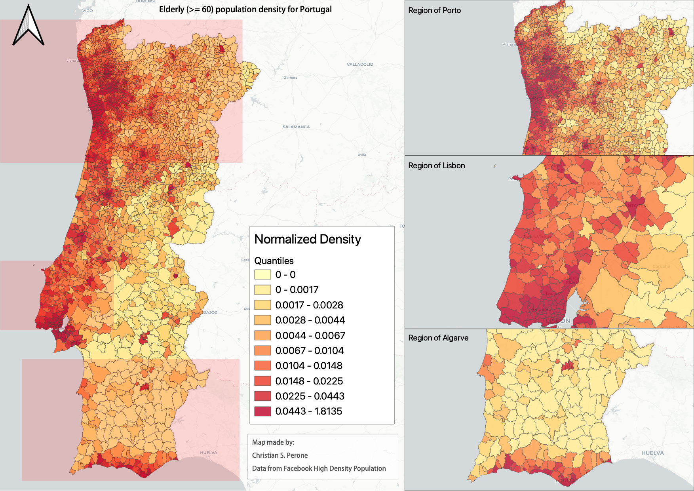

COVID-19 Analysis for Portugal
*******************************************************************************
This section contains analysis done for Portugal.

Portugal: country-wide analysis
===============================================================================

.. _ChangepointModelling:

Bayesian cases changepoint modelling
-------------------------------------------------------------------------------
The changepoint analysis is basically the same as
described `in this article <https://cscherrer.github.io/post/bayesian-changepoint/>`_,
where the switchpoint is modelled by a discrete uniform distribution that parametrizes
an early :math:`\alpha` and :math:`\beta` parameters of an exponential model using
a negative binomial likelihood.

The priors of the model are these:

.. math::

	\begin{array}{rcl}
	\text{switchpoint} &\sim & \text{DiscreteUniform}(\mathit{lower}=f(f()),~\mathit{upper}=f(f()))\\\text{alpha_mu} &\sim & \text{Normal}(\mathit{mu}=0.0,~\mathit{sigma}=6.0)\\\text{early_alpha} &\sim & \text{Normal}(\mathit{mu}=\text{alpha_mu},~\mathit{sigma}=6.0)\\\text{late_alpha} &\sim & \text{Normal}(\mathit{mu}=\text{alpha_mu},~\mathit{sigma}=6.0)\\\text{beta_mu} &\sim & \text{Normal}(\mathit{mu}=0.0,~\mathit{sigma}=6.0)\\\text{early_beta} &\sim & \text{Normal}(\mathit{mu}=\text{beta_mu},~\mathit{sigma}=6.0)\\\text{late_beta} &\sim & \text{Normal}(\mathit{mu}=\text{beta_mu},~\mathit{sigma}=6.0)\\\text{sigma} &\sim & \text{HalfCauchy}(\mathit{beta}=50.0)\\\text{y} &\sim & \text{NegativeBinomial}(\mathit{mu}=f(f(f(f(\text{switchpoint}),~array),~f(\text{early_alpha}),~f(\text{late_alpha})),~f(f(f(f(f(\text{switchpoint}),~array),~f(\text{early_beta}),~f(\text{late_beta})),~\text{data_x}))),~\mathit{alpha}=\text{sigma})
	\end{array}

The main idea of the model is that we want to learn a distribution over a discrete
switchpoint represented by days to identify where the coefficient of growth
changed and what was the early and late coefficient.

**05/April** -- Modelling ICU occupancy in Portugal
-------------------------------------------------------------------------------
This is a short animation showing ICU occupancy forecast for the days before
April 5th. After that date, the model started to become misspecified due to
potential intervention effects or change of criteria/procedures from
the portuguese government.

.. raw:: html

	<video controls width="740">
    <source src="_static/pt/icu_forecast_pt.mp4"
            type="video/mp4">
    	Sorry, your browser doesn't support embedded videos.
	</video>

**08/April** -- Changepoint detection for COVID-19 confirmed cases
------------------------------------------------------------------------------------
This is a changepoint analysis done with data up to April 8th. As we know, recently
there was a reduction of new cases. All evidence shows that what we're seeing is
effect of interventions, however, the question that this analysis tries to answer
is when can we say that we had a change in the growth factor ? It seems that
the most likely date that this happened was on March 30th, 14 days after the closure
of the schools in Portugal.

.. image:: _static/pt/changepoint_apr8.png
  :width: 700

.. seealso:: This model uses the modelling approach described at :ref:`ChangepointModelling`.

**21/April** -- High-resolution elderly population density in Portugal
------------------------------------------------------------------------------------
Just made a map of the elderly (>=60) population density in Portugal using Facebook's
high-resolution population maps (30 meters level resolution) with population allocation
estimation using satellite imagery + machine learning. Working on an interactive version of it.

Click on it for a high-resolution version.

