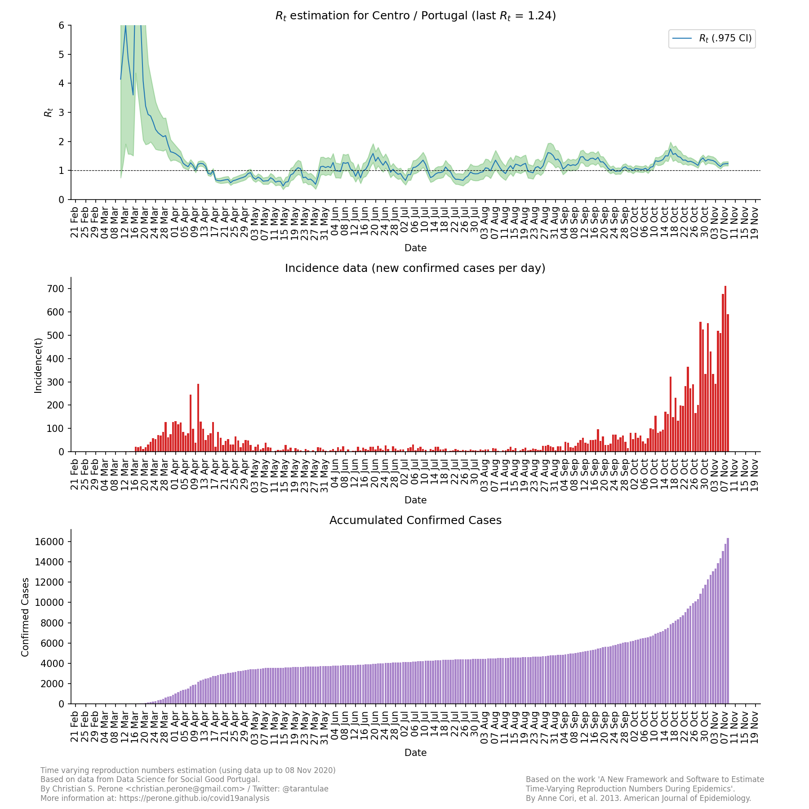
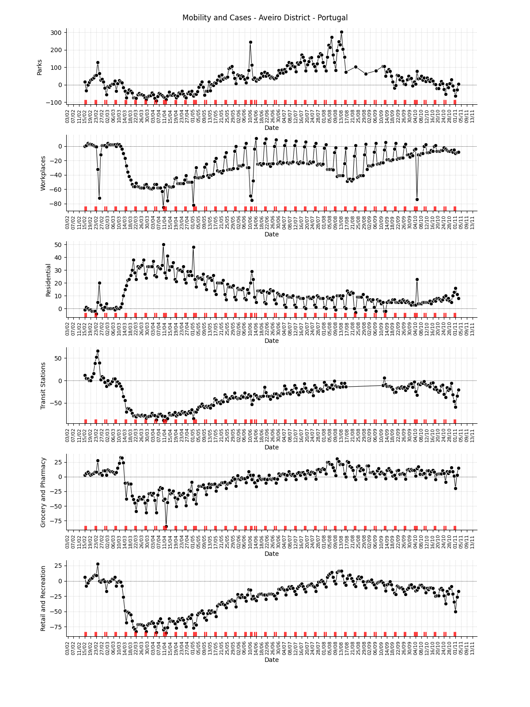
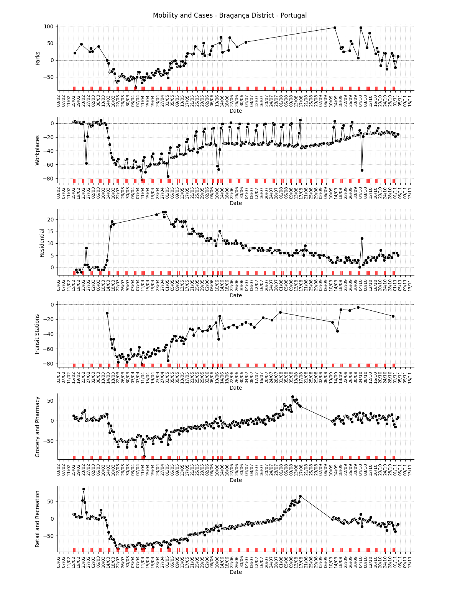
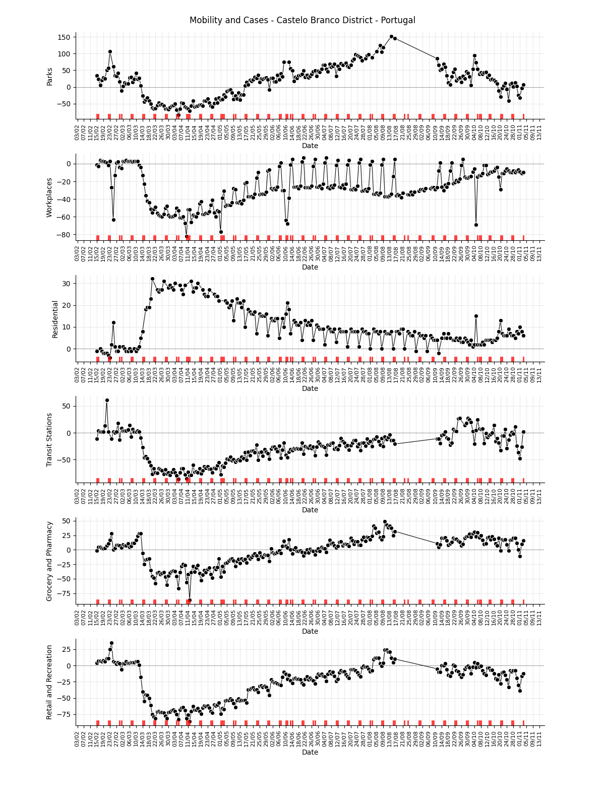
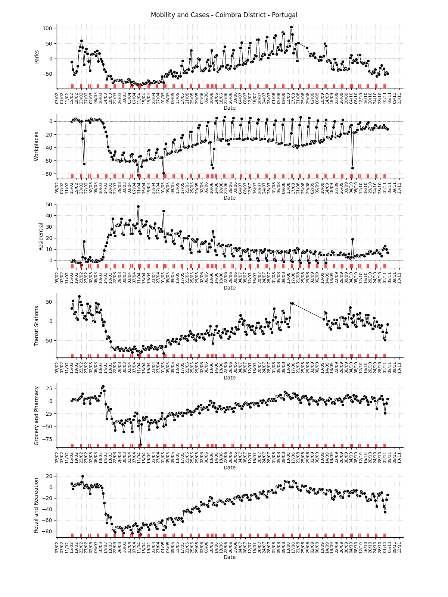
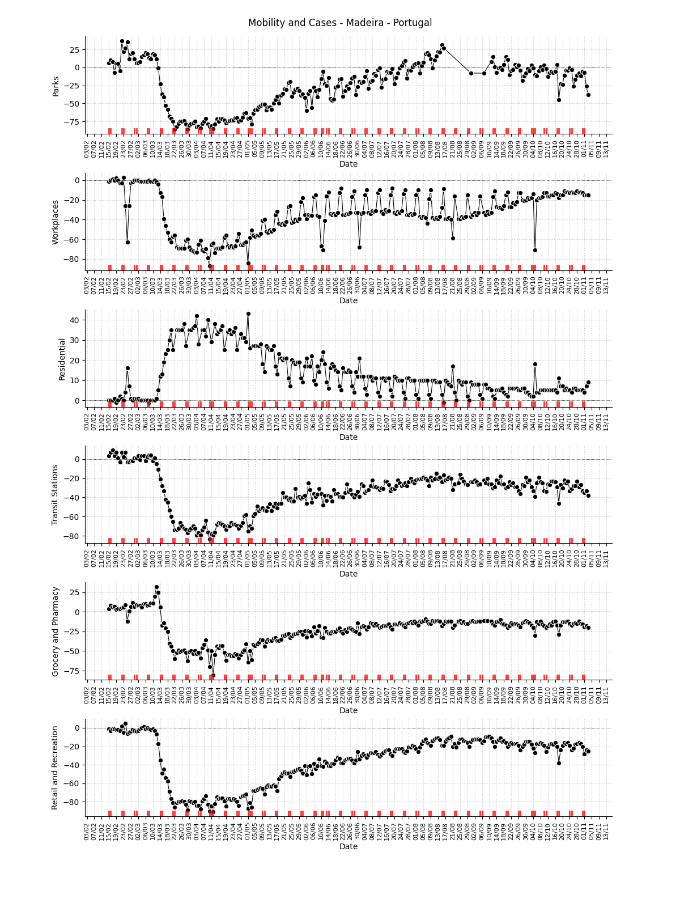
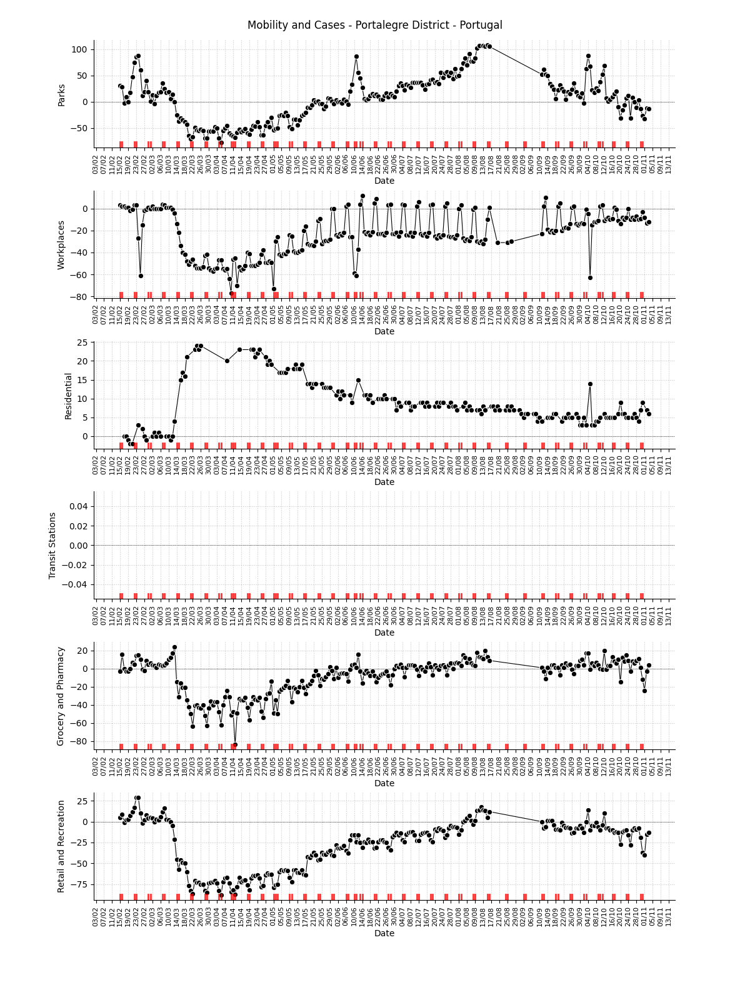
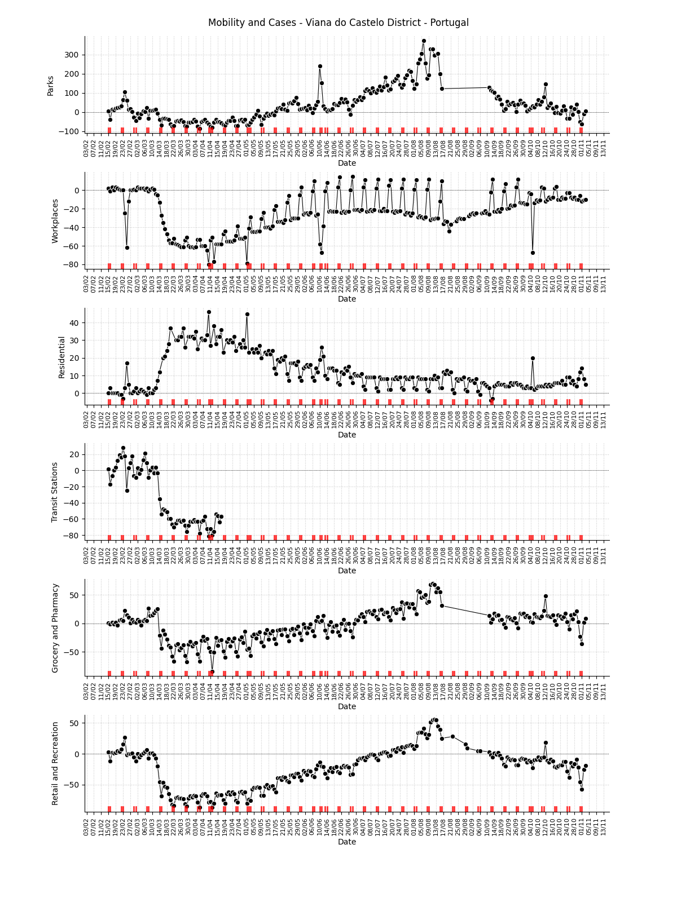
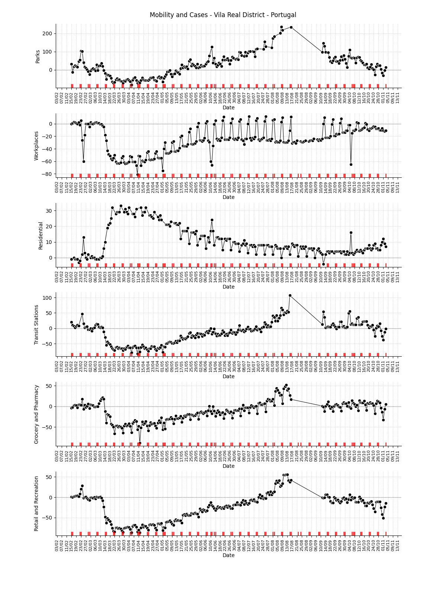

**08/June** -- COVID-19 Time varying reproduction numbers estimation for Portugal
*****************************************************************************************
These plots show the estimation of the instantaneous reproduction number for all
the regions in continental Portugal. These reports uses the method described in the work 
`A New Framework and Software to Estimate Time-Varying Reproduction Numbers During Epidemics <https://www.ncbi.nlm.nih.gov/pmc/articles/PMC3816335/>`_. We used the serial interval parameters similar to the ones used
by `CMMID <https://cmmid.github.io/topics/covid19/>`_ with a :math:`\mu = 4.7 (3.7 - 6.0)`
and :math:`\sigma = 2.9 (1.9 - 4.9)`.

.. note:: This plot uses official data Data Science for Social Good Portugal, reports until
          08/June. This method is sensitive to changes in COVID-19
          testing procedures and the level of effort used to detect cases.
          Therefore, changes in the testing efforts will introduce bias
          if the testing practices are not kept consistent. So please
          keep in mind these limitations, that are often not stated in
          many analysis around there. Imported cases weren't also
          considered in this analysis, neither the delay of the symptoms
          onset and reporting. I tried many times to enter in contact
          with DGS to understand why sometimes *accumulated cases* decrease
          from ony day to another, but they never answered, therefore I do
          linear interpolation when I have negative incidence.

Summary for the last instantaneous reproduction number estimate
===============================================================================
.. rubric:: Map for the accumulated cases

.. raw:: html

    <iframe src="_static/restim_cases_map_pt_continental.html" height="750px" width="100%" frameBorder="0"></iframe>

.. rubric:: Map for the last instantaneous reproduction number estimate

.. raw:: html

    <iframe src="_static/restim_map_pt_continental.html" height="750px" width="100%" frameBorder="0"></iframe>

.. rubric:: Map of states with mean reproduction number R(t) > 1.0

.. raw:: html

    <iframe src="_static/restim_badr_map_pt_continental.html" height="750px" width="100%" frameBorder="0"></iframe>

.. rubric:: Map for the accumulated deaths by COVID-19

.. raw:: html

    <iframe src="_static/restim_deaths_map_pt_continental.html" height="750px" width="100%" frameBorder="0"></iframe>

.. rubric:: Summary for the last instantaneous reproduction number estimate

Last update: **08/June**

.. image:: _static/pt/r0_estim/estim_all.svg
    :width: 700

.. rubric:: Summary table for the last instantaneous reproduction number estimate

.. raw:: html
    
    

    <table class="greyGridTable">
    <thead>
    <tr>
    <th>Region</th>
    <th>Mean Estimated R (CI 0.975)</th>
    </tr>
    </thead>
    <tbody>
    
    <tr>
        <td>alentejo</td>
        <td>1.63 (0.79 - 2.78)</td>
    </tr>
    
    <tr>
        <td>norte</td>
        <td>1.62 (1.29 - 1.98)</td>
    </tr>
    
    <tr>
        <td>algarve</td>
        <td>1.46 (0.85 - 2.24)</td>
    </tr>
    
    <tr>
        <td>centro</td>
        <td>1.25 (0.99 - 1.54)</td>
    </tr>
    
    <tr>
        <td>rlvt</td>
        <td>1.06 (1.00 - 1.12)</td>
    </tr>
    
    </tbody>
    </table>

**Region**: Alentejo
===============================================================================

.. image:: _static/pt/r0_estim/state_alentejo.png
  :width: 900

**Region**: Algarve
===============================================================================

.. image:: _static/pt/r0_estim/state_algarve.png
  :width: 900

**Region**: Centro
===============================================================================

**Region**: Norte
===============================================================================

.. image:: _static/pt/r0_estim/state_norte.png
  :width: 900

**Region**: Rlvt
===============================================================================

.. image:: _static/pt/r0_estim/state_rlvt.png
  :width: 900

**Mobility region**: Aveiro District
===============================================================================
.. rubric:: Mobility data for the sub-region

.. note:: This plot uses official mobility data from Google Community
          Mobility Reports. The red markers on the x-axis are
          weekends or holidays.

**Mobility region**: Azores
===============================================================================
.. rubric:: Mobility data for the sub-region

.. image:: _static/pt/r0_estim/mobility_state_azores.png
  :width: 1000

.. note:: This plot uses official mobility data from Google Community
          Mobility Reports. The red markers on the x-axis are
          weekends or holidays.

**Mobility region**: Beja District
===============================================================================
.. rubric:: Mobility data for the sub-region

.. image:: _static/pt/r0_estim/mobility_state_beja-district.png
  :width: 1000

.. note:: This plot uses official mobility data from Google Community
          Mobility Reports. The red markers on the x-axis are
          weekends or holidays.

**Mobility region**: Braga
===============================================================================
.. rubric:: Mobility data for the sub-region

.. image:: _static/pt/r0_estim/mobility_state_braga.png
  :width: 1000

.. note:: This plot uses official mobility data from Google Community
          Mobility Reports. The red markers on the x-axis are
          weekends or holidays.

**Mobility region**: Bragança District
===============================================================================
.. rubric:: Mobility data for the sub-region

.. note:: This plot uses official mobility data from Google Community
          Mobility Reports. The red markers on the x-axis are
          weekends or holidays.

**Mobility region**: Castelo Branco District
===============================================================================
.. rubric:: Mobility data for the sub-region

.. note:: This plot uses official mobility data from Google Community
          Mobility Reports. The red markers on the x-axis are
          weekends or holidays.

**Mobility region**: Coimbra District
===============================================================================
.. rubric:: Mobility data for the sub-region

.. note:: This plot uses official mobility data from Google Community
          Mobility Reports. The red markers on the x-axis are
          weekends or holidays.

**Mobility region**: Évora District
===============================================================================
.. rubric:: Mobility data for the sub-region

.. image:: _static/pt/r0_estim/mobility_state_evora-district.png
  :width: 1000

.. note:: This plot uses official mobility data from Google Community
          Mobility Reports. The red markers on the x-axis are
          weekends or holidays.

**Mobility region**: Faro District
===============================================================================
.. rubric:: Mobility data for the sub-region

.. image:: _static/pt/r0_estim/mobility_state_faro-district.png
  :width: 1000

.. note:: This plot uses official mobility data from Google Community
          Mobility Reports. The red markers on the x-axis are
          weekends or holidays.

**Mobility region**: Guarda District
===============================================================================
.. rubric:: Mobility data for the sub-region

.. note:: This plot uses official mobility data from Google Community
          Mobility Reports. The red markers on the x-axis are
          weekends or holidays.

**Mobility region**: Leiria District
===============================================================================
.. rubric:: Mobility data for the sub-region

.. image:: _static/pt/r0_estim/mobility_state_leiria-district.png
  :width: 1000

.. note:: This plot uses official mobility data from Google Community
          Mobility Reports. The red markers on the x-axis are
          weekends or holidays.

**Mobility region**: Lisbon
===============================================================================
.. rubric:: Mobility data for the sub-region

.. image:: _static/pt/r0_estim/mobility_state_lisbon.png
  :width: 1000

.. note:: This plot uses official mobility data from Google Community
          Mobility Reports. The red markers on the x-axis are
          weekends or holidays.

**Mobility region**: Madeira
===============================================================================
.. rubric:: Mobility data for the sub-region

.. note:: This plot uses official mobility data from Google Community
          Mobility Reports. The red markers on the x-axis are
          weekends or holidays.

**Mobility region**: Portalegre District
===============================================================================
.. rubric:: Mobility data for the sub-region

.. note:: This plot uses official mobility data from Google Community
          Mobility Reports. The red markers on the x-axis are
          weekends or holidays.

**Mobility region**: Porto District
===============================================================================
.. rubric:: Mobility data for the sub-region

.. image:: _static/pt/r0_estim/mobility_state_porto-district.png
  :width: 1000

.. note:: This plot uses official mobility data from Google Community
          Mobility Reports. The red markers on the x-axis are
          weekends or holidays.

**Mobility region**: Santarém District
===============================================================================
.. rubric:: Mobility data for the sub-region

.. image:: _static/pt/r0_estim/mobility_state_santarem-district.png
  :width: 1000

.. note:: This plot uses official mobility data from Google Community
          Mobility Reports. The red markers on the x-axis are
          weekends or holidays.

**Mobility region**: Setubal
===============================================================================
.. rubric:: Mobility data for the sub-region

.. image:: _static/pt/r0_estim/mobility_state_setubal.png
  :width: 1000

.. note:: This plot uses official mobility data from Google Community
          Mobility Reports. The red markers on the x-axis are
          weekends or holidays.

**Mobility region**: Viana do Castelo District
===============================================================================
.. rubric:: Mobility data for the sub-region

.. note:: This plot uses official mobility data from Google Community
          Mobility Reports. The red markers on the x-axis are
          weekends or holidays.

**Mobility region**: Vila Real District
===============================================================================
.. rubric:: Mobility data for the sub-region

.. note:: This plot uses official mobility data from Google Community
          Mobility Reports. The red markers on the x-axis are
          weekends or holidays.

**Mobility region**: Viseu District
===============================================================================
.. rubric:: Mobility data for the sub-region

.. image:: _static/pt/r0_estim/mobility_state_viseu-district.png
  :width: 1000

.. note:: This plot uses official mobility data from Google Community
          Mobility Reports. The red markers on the x-axis are
          weekends or holidays.

